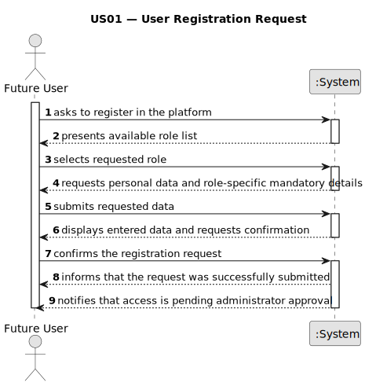

# US01 — User Registration Request

## 1. Requirements Engineering

### 1.1. User Story Description

As a future user, I want to submit a registration request to the platform, selecting the role that reflects my intended 
level of access and responsibilities.

---

### 1.2. Customer Specifications and Clarifications

**From the specifications document:**

> The system shall allow any external party to initiate a registration process before gaining access to any protected 
> functionality.

> The requested role determines which permissions will be provisionally associated with the account pending administrator 
> review.

> An administrator must explicitly approve or reject the request (US002) before the account becomes operative.

---

### 1.3. Acceptance Criteria

* **AC1:** The role must be selected from a predefined list of available roles.

---

### 1.4. Found-out Dependencies

* **US02 — Approve/Reject Registration:** The lifecycle of the entity created in US001 is completed by US002. Without 
this story, no request can transition from PENDING to an active account.

---

### 1.5. Input and Output Data

**Input Data:**

* Typed data:
  * Personal identification (name, contact, credentials)
  * Authentication data (password conforming to security policy)
* Selected data:
  * Role (from system-defined list — AC1)

**Output Data:**

* List of available roles for selection
* Summary of submitted data for user review
* Submission acknowledgement with PENDING status confirmation

---

### 1.6. System Sequence Diagram (SSD)

---

### 1.7. Other Relevant Remarks

* The password must comply with the non-functional security requirement: seven alphanumeric characters including at 
least three uppercase letters and two digits.
* No personally identifiable information is exposed to other users during the pending phase.
* The request entity must support serialization to guarantee data persistence across application restarts.