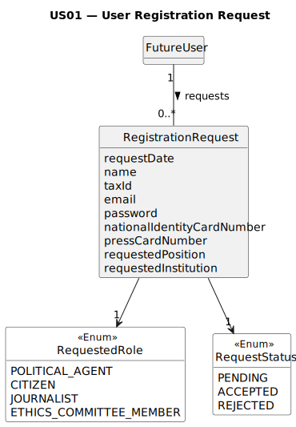

# US01 — User Registration Request

## 2. Analysis

### 2.1. Relevant Domain Model Excerpt 

### 2.2. Other Remarks

The `Role` is associated with `RegistrationRequest` rather than directly with `User`, since at this stage the user is 
only requesting a role — no assignment has taken place yet. The actual assignment of a role to a user occurs only upon 
administrator approval (US002).