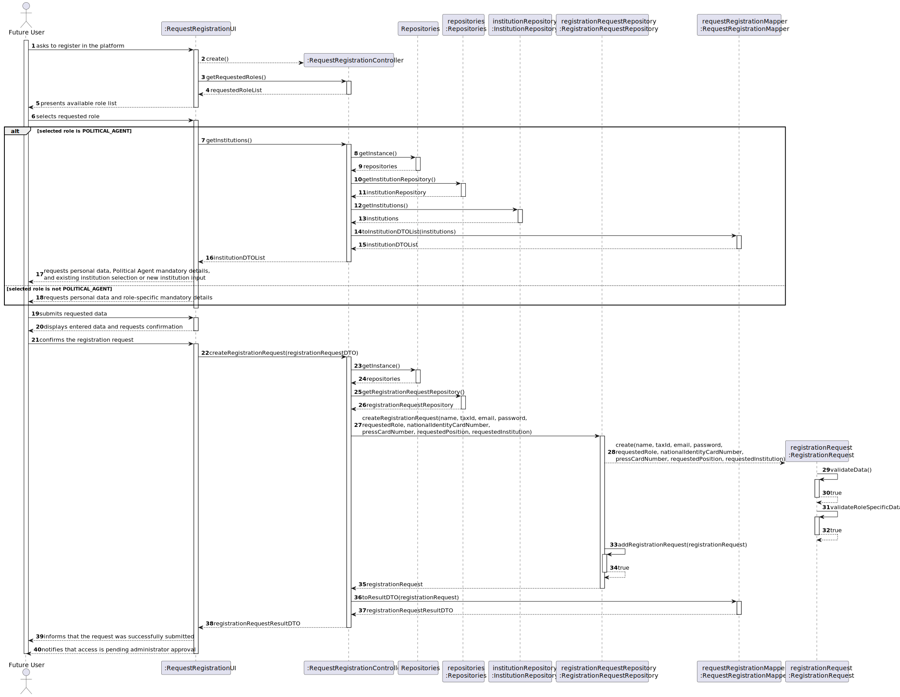
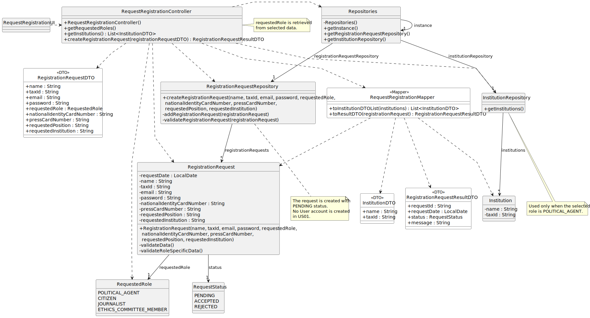

# US01 — User Registration Request

## 3. Design

### 3.1. Rationale

| Interaction ID | Question: Which class is responsible for...                                             | Answer                        | Justification (with patterns)                                                                                                     |
|:---------------|:----------------------------------------------------------------------------------------|:------------------------------|:----------------------------------------------------------------------------------------------------------------------------------|
| Step 1         | ... interacting with the actor?                                                         | RequestRegistrationUI         | Pure Fabrication: there is no reason to assign this responsibility to any existing class in the Domain Model.                     |
|                | ... coordinating the US?                                                                | RequestRegistrationController | Controller: coordinates the flow of this user story and acts as an intermediary between the UI and the domain/repository classes. |
|                | ... knowing the available roles?                                                        | RequestedRole                 | Information Expert: the available roles are defined by the enumeration itself.                                                    |
| Step 2         | ... saving the selected role temporarily?                                               | RequestRegistrationUI         | Information Expert: the UI keeps the data selected by the actor until the request is submitted.                                   |
|                | ... requesting role-specific mandatory details?                                         | RequestRegistrationUI         | Pure Fabrication: responsible for user interaction and for asking the actor for the required data.                                |
|                | ... knowing existing institutions to display when the selected role is Political Agent? | InstitutionRepository         | Information Expert / Pure Fabrication: it keeps the collection of registered institutions.                                        |
| Step 3         | ... saving the inputted data temporarily?                                               | RequestRegistrationUI         | Information Expert: the UI keeps the data typed by the actor before confirmation.                                                 |
|                | ... showing the entered data and requesting confirmation?                               | RequestRegistrationUI         | Pure Fabrication: responsible for displaying information and interacting with the actor.                                          |
| Step 4         | ... creating the RegistrationRequest?                                                   | RegistrationRequestRepository | Creator: the repository records and manages RegistrationRequest instances.                                                        |
|                | ... validating the request data locally?                                                | RegistrationRequest           | Information Expert: the request owns its own data and can validate its mandatory and role-specific attributes.                    |
|                | ... setting the initial request status as PENDING?                                      | RegistrationRequest           | Information Expert: the status belongs to the RegistrationRequest being created.                                                  |
|                | ... saving the created registration request?                                            | RegistrationRequestRepository | Information Expert: it knows and manages all registration requests.                                                               |
|                | ... informing operation success?                                                        | RequestRegistrationUI         | Pure Fabrication: responsible for user interaction and feedback.                                                                  |

### Systematization

According to the taken rationale, the conceptual classes promoted to software classes are:

* RegistrationRequest
* RequestedRole
* RequestStatus
* Institution

`FutureUser` is not promoted to a software class in this realization because, in US01, the person is represented as an external actor and no active platform account exists yet.

Other software classes identified:

* RequestRegistrationUI
* RequestRegistrationController
* Repositories
* RegistrationRequestRepository
* InstitutionRepository

---

## 3.2. Sequence Diagram (SD)

### Full Diagram

This diagram shows the full sequence of interactions between the classes involved in the realization of this user story.

### Split Diagrams

No split diagrams were produced for this user story because the full sequence diagram is small enough to be read as a single diagram.

---

## 3.3. Class Diagram (CD)

