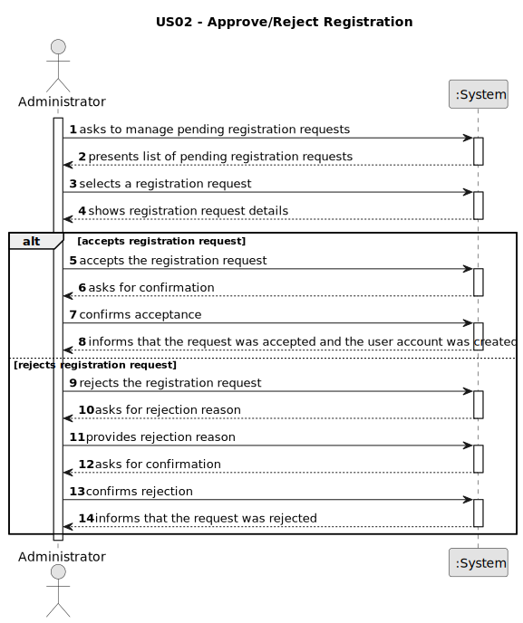

# US02 - Approve/Reject Registration

## 1. Requirements Engineering

### 1.1. User Story Description

As an Administrator, I want to accept or reject registration requests so that only authorized users gain access to the 
platform.

---

### 1.2. Customer Specifications and Clarifications

**From the specifications document:**

> The system must allow an Administrator to accept or reject registration requests submitted by future users.

> The System Administrator is responsible for managing the system and its access privileges.

---

### 1.3. Acceptance Criteria

N/A

---

### 1.4. Found out Dependencies

* **US01 — Registration Request:** since a request must exist before it can be accepted or rejected.

---

### 1.5. Input and Output Data

**Input Data:**

* Selected data:
  * a pending registration request

* Typed data:
  * decision (accept or reject)

**Output Data:**

* List of pending registration requests
* Details of the selected request
* Result of the operation (success or failure)

---

### 1.6. System Sequence Diagram (SSD)

---

### 1.7. Other Relevant Remarks

* An accepted request results in an active user account with the role and permissions originally requested.
* A rejected request does not create any account; the requester may be informed of the outcome.