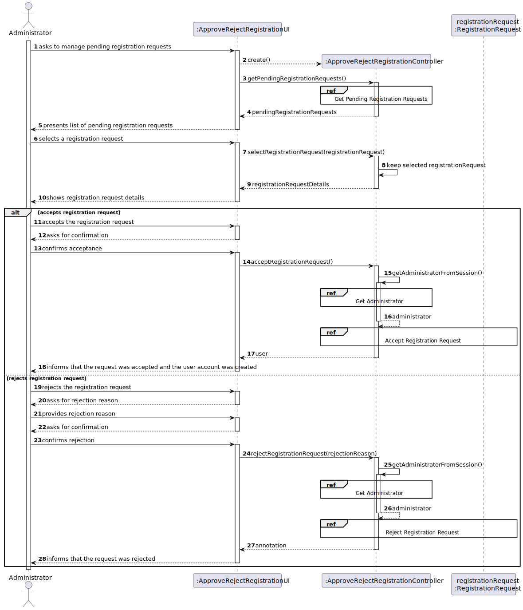
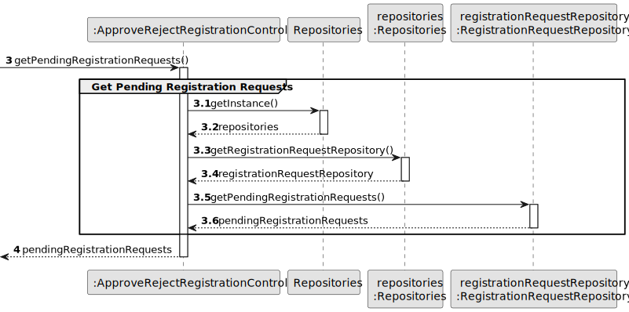
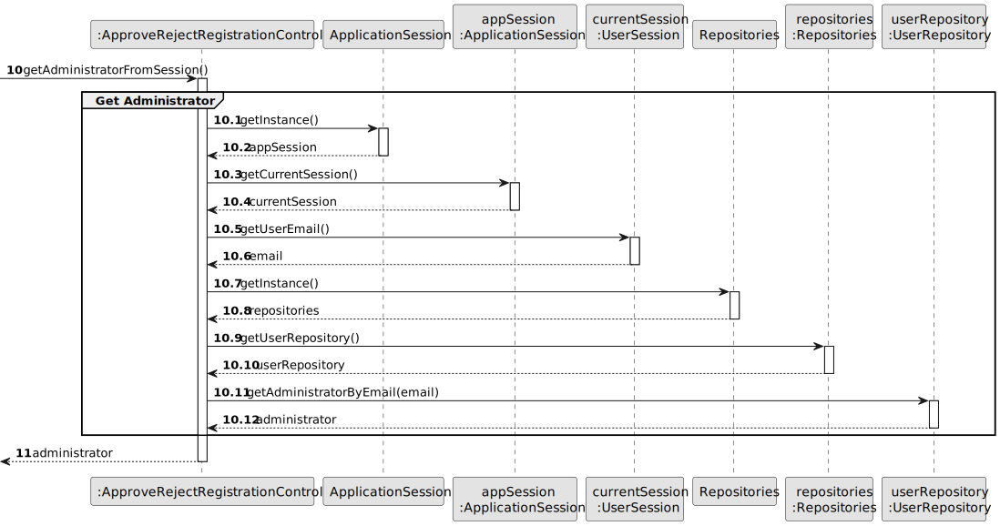
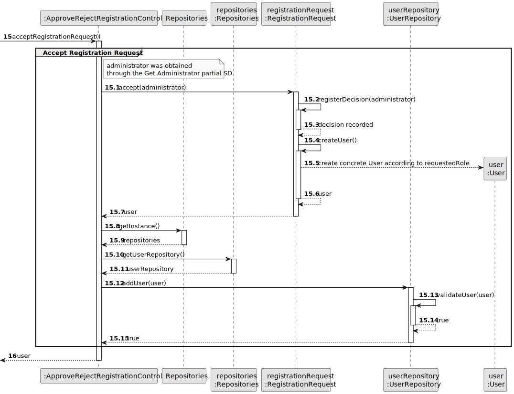
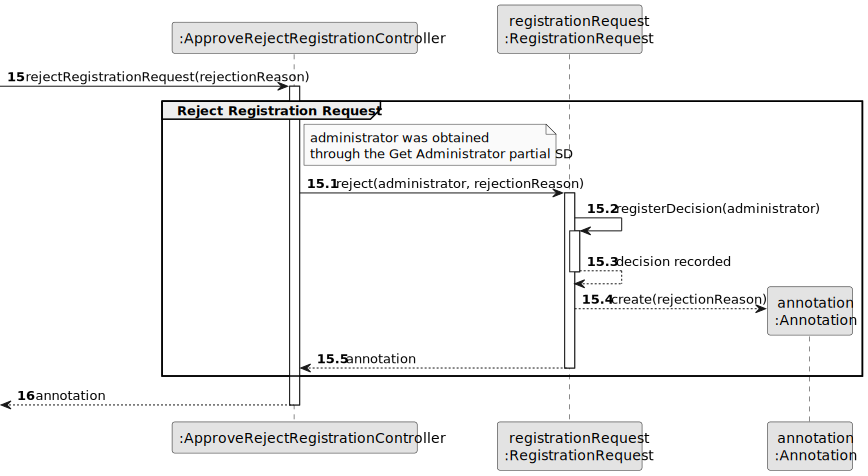
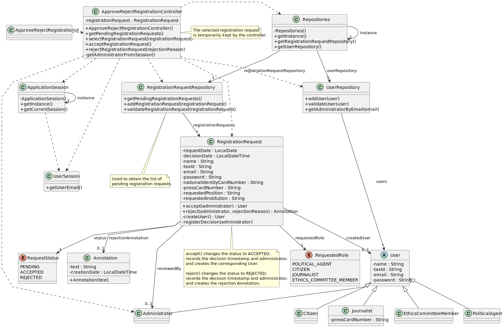

# US02 - Approve/Reject Registration

## 3. Design

### 3.1. Rationale

| Interaction ID | Question: Which class is responsible for...                        | Answer                              | Justification (with patterns)                                                                                                                         |
|:---------------|:-------------------------------------------------------------------|:------------------------------------|:------------------------------------------------------------------------------------------------------------------------------------------------------|
| Step 1         | ... interacting with the actor?                                    | ApproveRejectRegistrationUI         | Pure Fabrication: there is no reason to assign this responsibility to any existing class in the Domain Model.                                         |
|                | ... coordinating the US?                                           | ApproveRejectRegistrationController | Controller: coordinates the flow of this user story and acts as an intermediary between the UI and the domain/repository classes.                     |
|                | ... knowing all pending registration requests?                     | RegistrationRequestRepository       | Information Expert: it keeps and manages the collection of RegistrationRequest instances.                                                             |
|                | ... converting pending registration requests into data safe to return to the UI? | RegistrationRequestMapper           | Mapper / DTO: converts domain objects into DTOs so that the UI does not receive domain objects directly.                                               |
|                | ... providing access to the registration request repository?       | Repositories                        | Information Expert / Pure Fabrication: it provides access to the system repositories while keeping the controller decoupled from repository creation. |
| Step 2         | ... saving the selected registration request?                      | ApproveRejectRegistrationController | Information Expert: the controller keeps the selected request during the execution of the user story.                                                 |
|                | ... showing the selected request details?                          | ApproveRejectRegistrationUI         | Pure Fabrication: responsible for displaying information and interacting with the actor.                                                              |
|                | ... knowing the selected request details?                          | RegistrationRequest                 | Information Expert: it owns the data submitted in the registration request.                                                                           |
|                | ... converting request details into data safe to return to the UI? | RegistrationRequestMapper           | Mapper / DTO: builds a details DTO with only the information needed by the UI.                                                                         |
| Step 3         | ... requesting the decision?                                       | ApproveRejectRegistrationUI         | Pure Fabrication: responsible for user interaction.                                                                                                   |
|                | ... obtaining the Administrator using the system?                  | ApplicationSession                  | Information Expert: it knows the current user session.                                                                                                |
|                | ... knowing the email of the user using the system?                | UserSession                         | Information Expert: it knows the authenticated user's email.                                                                                          |
|                | ... finding the Administrator associated with the current session? | UserRepository                      | Information Expert: it keeps and manages User instances.                                                                                              |
| Step 4         | ... accepting the registration request?                            | RegistrationRequest                 | Information Expert: it knows its own status, requested role, decision date and submitted data.                                                        |
|                | ... recording the decision timestamp and Administrator?            | RegistrationRequest                 | Information Expert: the decision data belongs to the request being reviewed.                                                                          |
|                | ... creating the corresponding User when the request is accepted?  | RegistrationRequest                 | Creator: it has the data required to create the concrete User according to the requested role.                                                        |
|                | ... saving the created User?                                       | UserRepository                      | Information Expert: it manages User instances.                                                                                                        |
| Step 5         | ... rejecting the registration request?                            | RegistrationRequest                 | Information Expert: it knows and changes its own lifecycle status.                                                                                    |
|                | ... creating the rejection reason/comment?                         | RegistrationRequest                 | Creator: the rejection Annotation is created in the context of rejecting a specific RegistrationRequest.                                              |
|                | ... storing the rejection reason/comment?                          | Annotation                          | Information Expert: it owns the rejection text and creation date.                                                                                     |
| Step 6         | ... preparing the notification data after the decision?            | RegistrationRequestMapper           | Mapper / DTO: builds a notification DTO with recipient, subject and message. In rejection, it uses the created Annotation as the source of the reason. |
|                | ... providing a stable interface for sending notification emails?  | EmailService                        | Protected Variations: hides the concrete email provider used by the system.                                                                            |
|                | ... selecting the configured email provider implementation?        | EmailServiceFactory                 | Factory / Protected Variations: reads the configured class and creates the selected email adapter.                                                     |
|                | ... instantiating the configured email adapter?                    | Java Reflection                     | The adapter class name is read from configuration, so the system does not depend on a concrete provider at compile time.                               |
|                | ... adapting requests to Gmail?                                    | GmailEmailServiceAdapter            | Adapter: converts the stable `EmailService` request into the Gmail-specific API call.                                                                  |
|                | ... adapting requests to the DEI email service?                    | DeiEmailServiceAdapter              | Adapter: converts the stable `EmailService` request into the DEI-specific API call.                                                                    |
| Step 7         | ... informing operation success?                                   | ApproveRejectRegistrationUI         | Pure Fabrication: responsible for user interaction and feedback.                                                                                      |

### Systematization

According to the taken rationale, the conceptual classes promoted to software classes are:

* RegistrationRequest
* User
* PoliticalAgent
* Citizen
* Journalist
* EthicsCommitteeMember
* Administrator
* Annotation
* Notification
* RequestedRole
* RequestStatus

Other software classes identified:

* ApproveRejectRegistrationUI
* ApproveRejectRegistrationController
* Repositories
* RegistrationRequestRepository
* UserRepository
* ApplicationSession
* UserSession
* PendingRegistrationRequestDTO
* RegistrationRequestDetailsDTO
* RegistrationDecisionDTO
* RegistrationDecisionNotificationDTO
* RegistrationRequestMapper
* EmailService
* GmailEmailServiceAdapter
* DeiEmailServiceAdapter
* EmailServiceFactory
* ApplicationProperties

DTOs are used when information crosses the UI/controller boundary. The UI receives request summaries and details as DTOs instead of receiving `RegistrationRequest` domain objects directly.

`Annotation` and `Notification` have different responsibilities. The `Annotation` records the internal rejection reason for traceability, while the `Notification` communicates the decision to the requester. When the decision is a rejection, the notification message uses the reason stored in the `Annotation`.

The email provider is a variation point. The controller depends on the stable `EmailService` interface, while concrete providers are isolated in adapters. The selected adapter is defined in a configuration file and instantiated using Java Reflection.

---

## 3.2. Sequence Diagram (SD)

### Full Diagram

This diagram shows the full sequence of interactions between the classes involved in the realization of this user story.

### Split Diagrams

The following diagram shows the same sequence of interactions between the classes involved in the realization of this user story, but it is split in partial diagrams to better illustrate the interactions between the classes.

It uses Interaction Occurrence (a.k.a. Interaction Use).

**Get Pending Registration Requests**

**Get Administrator**

**Accept Registration Request**

**Reject Registration Request**

**Send Registration Decision Notification**

This partial sequence documents the email notification flow and the email provider selection through a configuration file and Java Reflection. The PUML source is available in `puml/US02-SD-partial-send-notification.puml`.

---

## 3.3. Class Diagram (CD)

