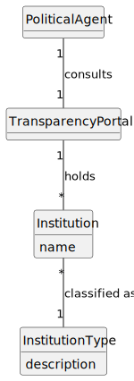

# US03 - List Institutions

## 2. Analysis

### 2.1. Relevant Domain Model Excerpt

### 2.2. Other Remarks

`Institution` is modeled as a catalog entity classified by `InstitutionType`, which directly supports AC1 of US03: institutions must be grouped by type. The type is not free text; it is selected from a predefined enumeration to guarantee consistent grouping semantics.

The alphabetical ordering requirement inside each group is supported by the `name` attribute of `Institution`. Since ordering is a presentation/query concern, no additional domain concept is required beyond the institution identity and classification.

US03 is a read operation performed by the `PoliticalAgent` over previously registered catalog data. For that reason, the excerpt includes the consultation association between `PoliticalAgent` and `Institution`, together with the stable catalog structure (`Institution` + `InstitutionType`).

This use case depends on US04 for data existence, because institutions only become listable after registration. The registration act itself is modeled in US04 (Administrator context), while US03 keeps the consultation perspective required by the user story.