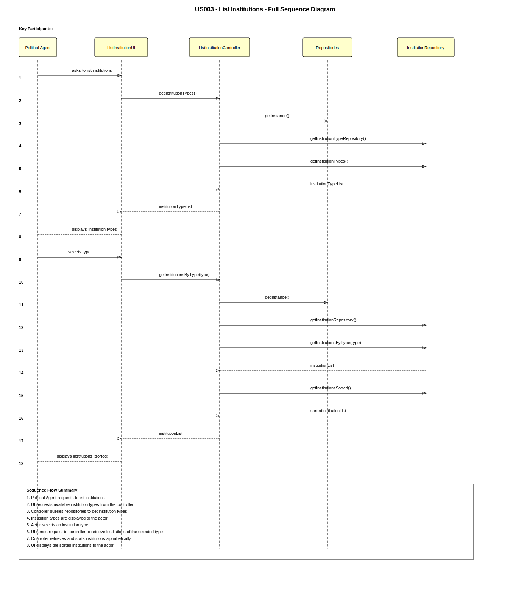
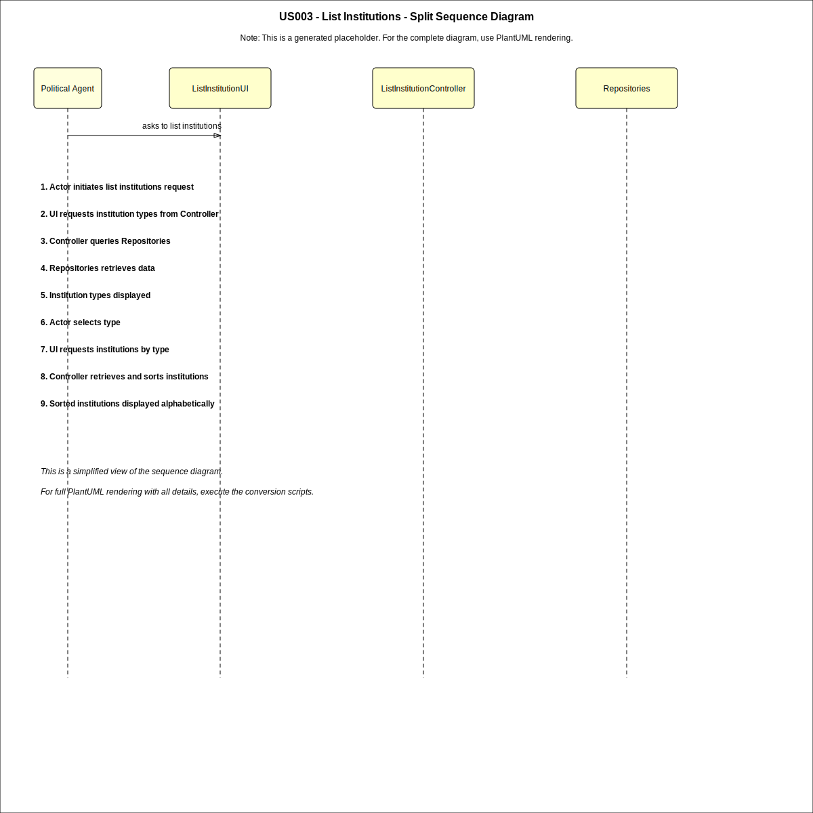
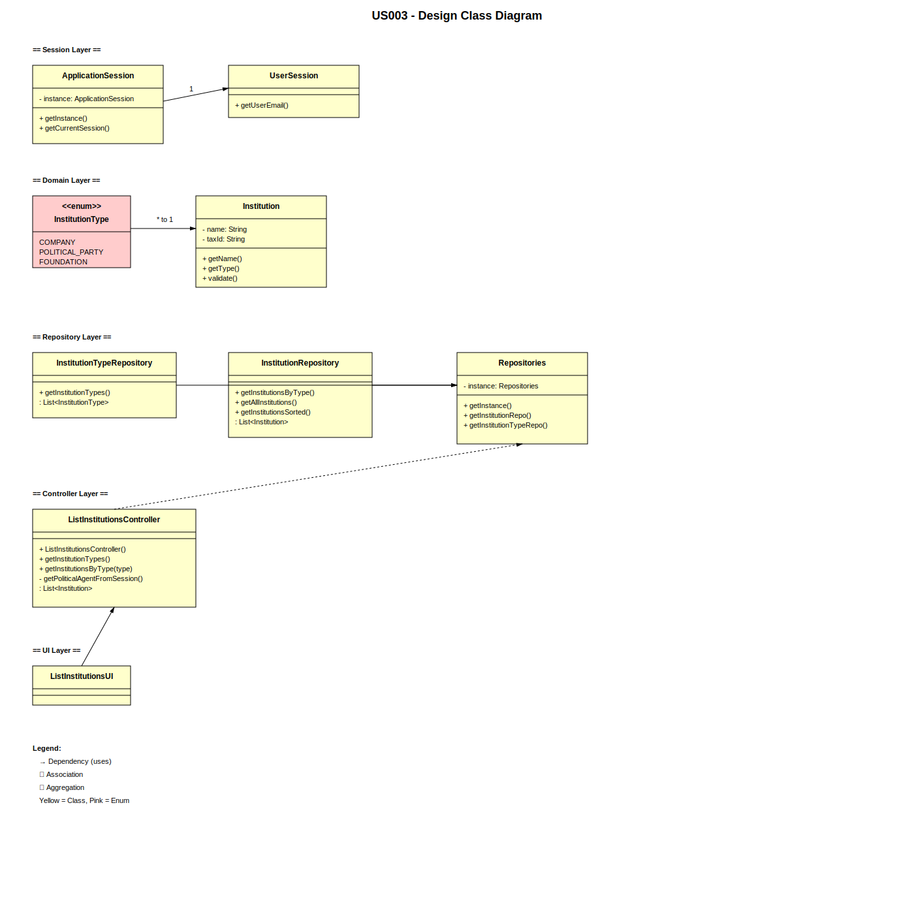

# US03 - List Institutions

## 3. Design

### 3.1. Rationale

| Interaction ID | Question: Which class is responsible for...                     | Answer                        | Justification (with patterns)                                          |
|:---------------|:----------------------------------------------------------------|:------------------------------|:-----------------------------------------------------------------------|
| Step 1         | ... interacting with the actor?                                 | ListInstitutionsUI            | Pure Fabrication: handles all user interaction.                        |
|                | ... coordinating the US?                                        | ListInstitutionsController    | Controller pattern: coordinates system operations.                     |
|                | ... knowing the user using the system?                          | UserSession                   | Information Expert: knows authenticated user information.              |
| Step 2         | ... obtaining available institution types?                      | InstitutionTypeRepository     | Information Expert: manages InstitutionType persistence.               |
|                | ... requesting institution type selection?                      | ListInstitutionsUI            | IE: responsible for interaction with the actor.                        |
| Step 3         | ... saving selected institution type?                           | ListInstitutionsUI            | IE: temporarily keeps user input data.                                 |
| Step 4         | ... retrieving institutions by selected type?                   | InstitutionRepository         | IE: maintains Institution persistence and retrieval logic.             |
| Step 5         | ... ordering institutions alphabetically?                       | ListInstitutionsController    | Controller applies application logic before presentation.              |
| Step 6         | ... presenting institutions grouped by type and success?        | ListInstitutionsUI            | Pure Fabrication: responsible for displaying results.                  |

### 3.2. Systematization

According to the taken rationale, the conceptual classes promoted to software classes are:

* Institution
* InstitutionType

> **Note:** Only `Institution` and `InstitutionType` are promoted from the domain model. No other attributes (e.g., address, nature of institution) appear in either the SSD interactions or the acceptance criteria for this US, so no additional conceptual classes are promoted. Introducing further classes without justification in the rationale would violate traceability between requirements and design.

Other software classes (i.e. Pure Fabrication) identified:

* ListInstitutionsUI
* ListInstitutionsController
* Repositories
* InstitutionRepository
* InstitutionTypeRepository
* ApplicationSession
* UserSession

## 3.3. Sequence Diagram (SD)

### Full Diagram

### Split Diagrams

## 3.4. Class Diagram (CD)

