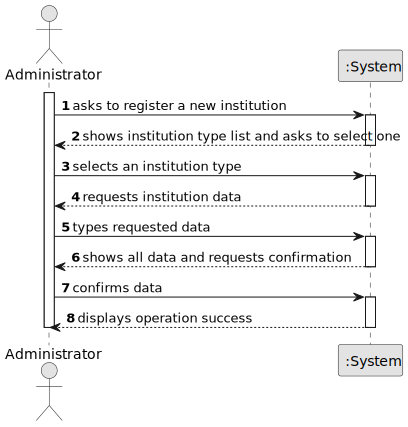

# US04 - Register an Institution

## 1. Requirements Engineering

### 1.1. User Story Description

As an Administrator, I want to register an Institution of a given type.

### 1.2. Customer Specifications and Clarifications

**From the specifications document:**

> The system must support the capture and storage of information related to political actors and their connections.

> Institutions are part of declarations of interests and must be available in the platform domain.

**From the client clarifications:**

> **Question:** Can any user register an institution?

> **Answer:** No. This is an administrative operation.

> **Question:** Should there be validation rules to prevent duplicate institutions?

> **Answer:** Duplicate handling is considered a technical concern.

---

### 1.3. Acceptance Criteria

* **AC1:** The institution type must be selected from a predefined list of available types.
* **AC2:** The institution name must not be null or empty; the system must reject any registration attempt with a blank name.
* **AC3:** The system must prevent the registration of duplicate institutions; an institution is considered a duplicate if it has the same name and the same type as an already-registered institution.

---

### 1.4. Found out Dependencies

* There is a dependency on role and access management (US01 and US02), because only an Administrator can execute this operation.
* There is a dependency on a predefined institution type list, required by AC1.

---

### 1.5 Input and Output Data

**Input Data:**

* Typed data:
    * institution identification data (e.g., institution name)

* Selected data:
    * institution type (from predefined list)

**Output Data:**

* List of available institution types
* (In)Success of the operation

---

### 1.6. System Sequence Diagram (SSD)

### 1.7 Other Relevant Remarks

* The predefined institution types for Sprint 1 are: Company, Political Party, Foundation, Institute, and Association (see AC1).
* Duplicate prevention (AC3) was originally described by the client as a "technical concern"; it is here formalised as a business rule to ensure catalog integrity across the platform.