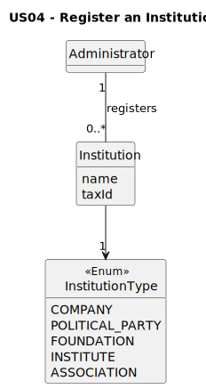

# US04 - Register an Institution

## 2. Analysis

### 2.1. Relevant Domain Model Excerpt

### 2.2. Other Remarks

`InstitutionType` is modeled as an enumeration with predefined values (COMPANY, POLITICAL_PARTY, FOUNDATION, INSTITUTE, ASSOCIATION), directly satisfying AC1 of US04. Modeling the type as an enum avoids inconsistent free-text classifications and guarantees compatibility with later grouped listing in US03.

The association `Administrator registers Institution` captures the ownership of this operation by the Administrator role. Institution registration is therefore represented as an administrative act over a shared catalog entity, not as an action available to all user roles.

`Institution` is modeled with core identification data (notably `name`, and in the global model also `taxId`) because institutions are referenced in multiple declaration items (for example, as subsidy source, position institution, or company of a security holding). Registering the institution once in a catalog avoids duplication and keeps declarations consistent.

US04 is the producer use case for the institution catalog, while US03 is a consumer use case that lists the same data. This producer-consumer relation justifies keeping institution typing mandatory at creation time and stable over subsequent consultations.