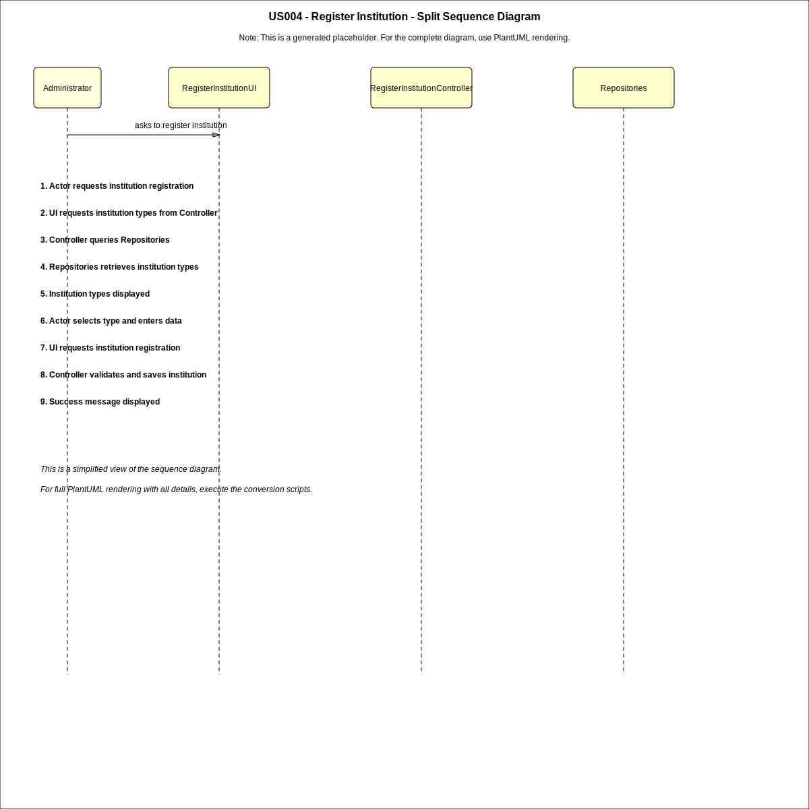
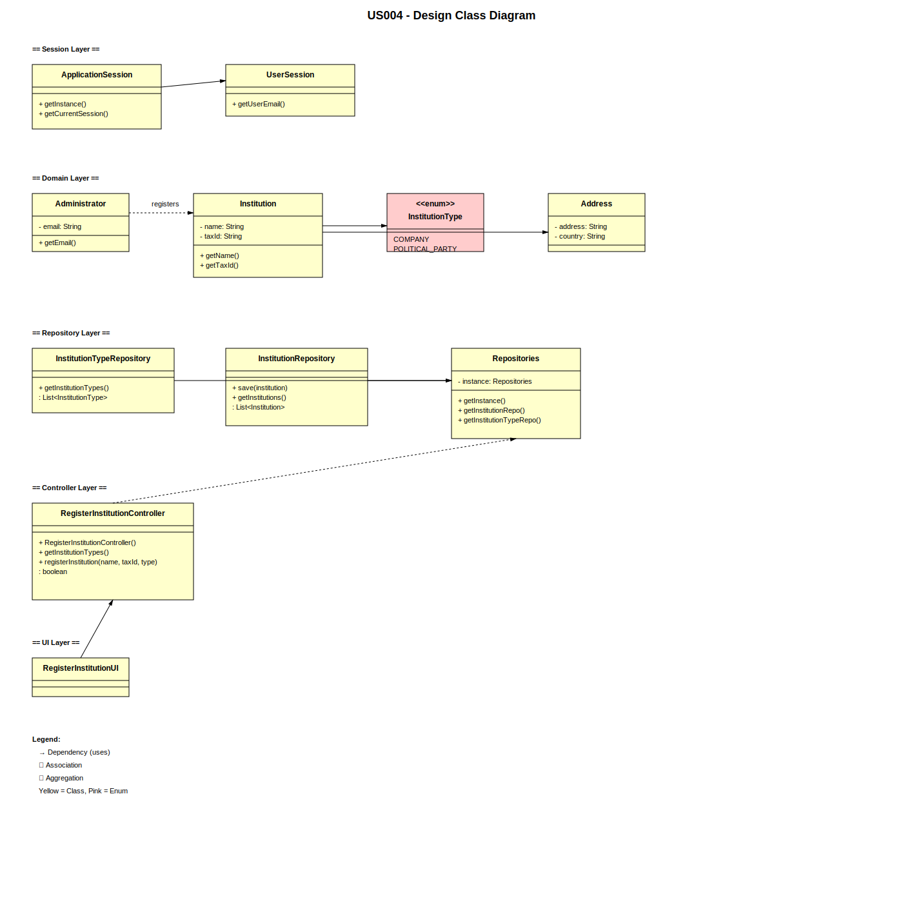

# US04 - Register an Institution

## 3. Design

### 3.1. Rationale

| Interaction ID | Question: Which class is responsible for...                 | Answer                          | Justification (with patterns)                                                |
|:---------------|:------------------------------------------------------------|:--------------------------------|:-----------------------------------------------------------------------------|
| Step 1         | ... interacting with the actor?                             | RegisterInstitutionUI           | Pure Fabrication: responsible for handling user interaction.                 |
|                | ... coordinating the US?                                    | RegisterInstitutionController   | Controller pattern: coordinates the use case execution.                      |
|                | ... knowing the user using the system?                      | UserSession                     | Information Expert: knows authenticated user information.                    |
| Step 2         | ... requesting institution type selection?                  | RegisterInstitutionUI           | IE: manages interaction with the actor.                                      |
|                | ... obtaining institution types?                            | InstitutionTypeRepository       | Information Expert: provides predefined InstitutionType list (AC1).          |
| Step 3         | ... saving selected institution type?                       | RegisterInstitutionUI           | IE: temporarily stores user input data.                                      |
| Step 4         | ... requesting institution data (name)?                     | RegisterInstitutionUI           | Responsible for user interaction.                                            |
| Step 5         | ... validating and creating the Institution?                | Administrator                   | Creator pattern: Administrator registers Institutions.                       |
|                | ... validating institution information (local validation)?  | Institution                     | Information Expert: owns its data and validation rules.                      |
|                | ... saving the new institution?                             | InstitutionRepository           | Information Expert: manages persistence of Institution objects.              |
| Step 6         | ... informing operation success?                            | RegisterInstitutionUI           | Pure Fabrication: presents result to the actor.                              |

### Systematization ##

According to the taken rationale, the conceptual classes promoted to software classes are:

* Administrator
* Institution
* InstitutionType

Other software classes (i.e. Pure Fabrication) identified:

* RegisterInstitutionUI
* RegisterInstitutionController
* Repositories
* InstitutionRepository
* InstitutionTypeRepository
* ApplicationSession
* UserSession

## 3.2. Sequence Diagram (SD)

### Full Diagram

### Split Diagrams

## 3.3. Class Diagram (CD)

