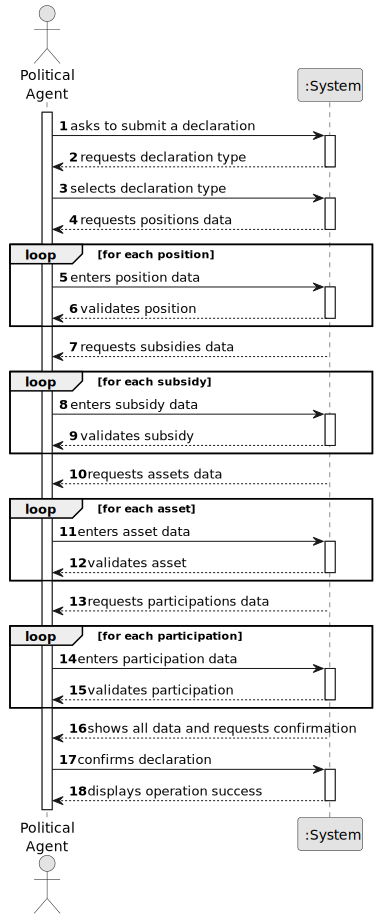

# US06 - Submit Declaration of Interests

## 1. Requirements Engineering

### 1.1. User Story Description

As a Political Agent, I want to submit a declaration of interests, so that
my financial and professional situation is recorded and can be analysed
for transparency purposes.

---

### 1.2. Customer Specifications and Clarifications

**From the specifications document:**

A declaration of interests must include information regarding:
- professional positions (public, private, and social) held or previously
  held, in which institutions, the nature of these institutions, the
  functions performed, and the payment received;
- support and subsidies received, from which institutions and the nature
  of the institution;
- assets (real estate: urban and rural) with their estimated value;
- quotas, shares, and holdings in companies, with their respective
  market values.

Declarations of Interest may be:
- **initial** – submitted when a political agent begins a term of office;
- **regular** – submitted annually while performing a political function;
- **exceptional** – submitted when there is a significant change in
  declared values, when requested by the ethics committee, or to
  correct errors/omissions in a previously submitted declaration.

**From the client clarifications:**

*(No clarifications available.)*

---

### 1.3. Acceptance Criteria

- **AC1:** The declaration must be associated with a registered and
  approved Political Agent.
- **AC2:** The Political Agent must select a declaration type (initial,
  regular, or exceptional).
- **AC3:** At least one entry (position, subsidy, asset, or participation)
  must be provided.
- **AC4:** Each position must include: institution, type
  (public/private/social), function performed, and remuneration.
- **AC5:** Each subsidy must include: the providing institution and
  the amount.
- **AC6:** Each asset must include: type (urban or rural real estate)
  and estimated value.
- **AC7:** Each business participation must include: the institution
  (company), type (quota/share/holding), and market value.
- **AC8:** The declaration must be stored with a submission date.
- **AC9:** The system must confirm successful submission.

---

### 1.4. Found out Dependencies

- **US01** – The Political Agent must be a registered user with the
  appropriate role.
- **US02** – The Political Agent registration must have been accepted
  by an Administrator.
- **US03** – List Institutions: required to select institutions for
  positions, subsidies, and participations.
- **US04** – Register Institution: institutions must exist before
  being referenced in a declaration.

---

### 1.5. Input and Output Data

**Input Data:**

*Typed data:*
- remuneration value (per position)
- subsidy amount (per subsidy)
- asset estimated value (per asset)
- participation market value (per participation)
- function performed (per position)

*Selected data:*
- declaration type (initial / regular / exceptional)
- institution (per position, per subsidy, and per participation)
- position type (public / private / social)
- asset type (urban real estate / rural real estate)
- participation type (quota / share / holding)

**Output Data:**
- (In)success of the operation
- If successful: declaration ID and submission date

---

### 1.6. System Sequence Diagram (SSD)

---

### 1.7. Other Relevant Remarks

- A Declaration aggregates multiple types of entries: positions,
  subsidies, assets, and business participations.
- Declarations form the data foundation for later temporal analysis
  (e.g., US09, US10, US11).
- A Political Agent may have multiple declarations of different types
  over time.