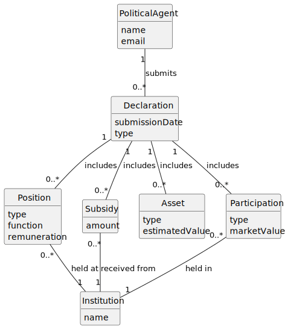

# US06 - OO Analysis

## 2.1. Domain Model Update

This user story introduces the following new conceptual classes:

- **Declaration** – represents a formal declaration of interests submitted
  by a Political Agent at a specific point in time.
- **Position** – represents a professional role (public, private, or
  social) held or previously held, performed at an Institution.
- **Subsidy** – represents support or a subsidy received by the
  Political Agent from an Institution.
- **Asset** – represents real estate property (urban or rural) owned
  by the Political Agent.
- **Participation** – represents a quota, share, or holding in a
  company (modelled as an Institution).

The concepts **PoliticalAgent** and **Institution** already exist in the
domain (introduced in US01/US02 and US03/US04 respectively) and are
reused here.

---

## 2.2. Identified Conceptual Classes

| Category | Conceptual / Candidate Class |
|---|---|
| (Business) Transactions | Declaration |
| Transaction line items | Position, Subsidy, Asset, Participation |
| Roles of People or Organizations | PoliticalAgent (existing) |
| (Other) Organizations | Institution (existing) |

---

## 2.3. Identified Associations

| Concept A | Association | Concept B |
|---|---|---|
| PoliticalAgent | submits | Declaration |
| Declaration | includes | Position |
| Declaration | includes | Subsidy |
| Declaration | includes | Asset |
| Declaration | includes | Participation |
| Position | held at | Institution |
| Subsidy | received from | Institution |
| Participation | held in | Institution |

---

## 2.4. Identified Attributes

**Declaration**
- submissionDate
- type

**Position**
- type
- function
- remuneration

**Subsidy**
- amount

**Asset**
- type
- estimatedValue

**Participation**
- type
- marketValue

---

## 2.5. Domain Model

---

## 2.6. Remarks

- **Attribute vs. Concept:** Declaration, Position, Subsidy, Asset, and
  Participation all have internal structure and multiple attributes,
  confirming they must be modelled as conceptual classes rather than
  simple attributes of PoliticalAgent.
- **Attribute vs. Association:** Institution is a concept in the domain
  (not a number or plain text), so the relationship between
  Position/Subsidy/Participation and Institution is modelled as an
  association, not as an attribute.
- **No generalisation applied to Asset:** although urban and rural real
  estate could be subclasses, no additional associations or distinct
  behaviours are identified at this stage; the distinction is captured
  via the `type` attribute.
- **Multiplicity justification:** A Declaration may include zero or more
  instances of each entry type (Position, Subsidy, Asset, Participation).
  The constraint that at least one entry must exist overall is enforced at
  the application level (AC3), not in the domain model multiplicities,
  since the combination of the four collections satisfies the rule.