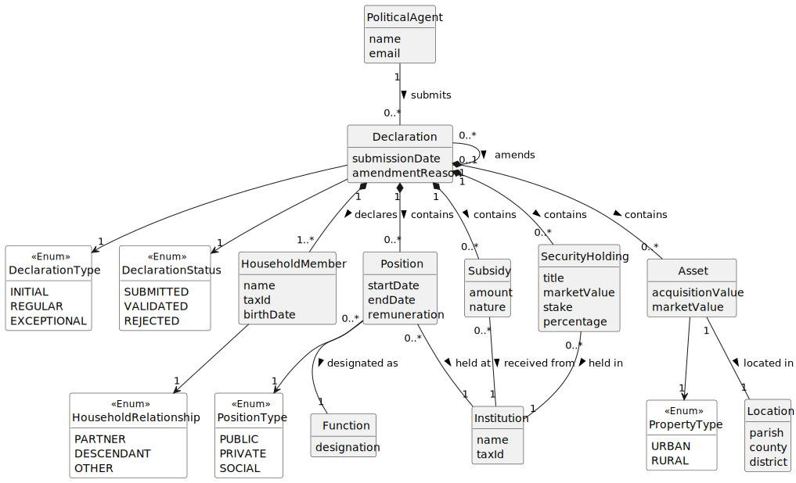

# US06 - OO Analysis

## 2.1. Domain Model Update

This user story introduces the following new conceptual classes:

- **Declaration** – represents a formal declaration of interests submitted
  by a Political Agent at a specific point in time. Its lifecycle state
  is tracked via DeclarationStatus, and its nature is described by
  DeclarationType.
- **Position** – represents a professional role (public, private, or
  social) held or previously held, performed at an Institution, with a
  designated Function.
- **Subsidy** – represents financial support received by the Political
  Agent from an Institution.
- **Asset** – represents real estate property (urban or rural) owned by
  the Political Agent, located at a specific Location.
- **SecurityHolding** – represents a quota, share, or holding in a
  company (modelled as an Institution), with a market value, stake and
  percentage.
- **Location** – represents the geographic location of an Asset,
  described by parish, county and district.

The concepts **PoliticalAgent**, **Institution**, and **Function** already
exist in the domain (introduced in US01/US02, US03/US04, and US05
respectively) and are reused here.

---

## 2.2. Identified Conceptual Classes

| Category | Conceptual / Candidate Class |
|---|---|
| (Business) Transactions | Declaration |
| Transaction line items | Position, Subsidy, Asset, SecurityHolding |
| Roles of People or Organizations | PoliticalAgent (existing) |
| (Other) Organizations | Institution (existing) |
| Catalogs | Function (existing) |
| Places | Location |
| Descriptions of Things | DeclarationType, DeclarationStatus, PositionType, PropertyType |

---

## 2.3. Identified Associations

| Concept A | Association | Concept B |
|---|---|---|
| PoliticalAgent | submits | Declaration |
| Declaration | typed as | DeclarationType |
| Declaration | has status | DeclarationStatus |
| Declaration | contains | Position |
| Declaration | contains | Subsidy |
| Declaration | contains | Asset |
| Declaration | contains | SecurityHolding |
| Position | classified as | PositionType |
| Position | held at | Institution |
| Position | designated as | Function |
| Subsidy | received from | Institution |
| Asset | classified as | PropertyType |
| Asset | located in | Location |
| SecurityHolding | held in | Institution |

---

## 2.4. Identified Attributes

**Declaration**
- submissionDate

**Position**
- startDate
- endDate
- remuneration

**Subsidy**
- amount
- nature

**Asset**
- acquisitionValue
- marketValue

**SecurityHolding**
- title
- marketValue
- stake
- percentage

**Location**
- parish
- county
- district

---

## 2.5. Domain Model

---

## 2.6. Remarks

- **SecurityHolding vs Participation:** The concept previously referred to
  as Participation is modelled in the global domain as SecurityHolding,
  reflecting the financial instrument nature of quotas, shares and
  holdings more precisely.
- **Attribute vs. Concept:** Declaration, Position, Subsidy, Asset,
  SecurityHolding, and Location all have internal structure and multiple
  attributes, confirming they must be modelled as conceptual classes
  rather than simple attributes of PoliticalAgent.
- **Attribute vs. Association:** Institution and Function are domain
  concepts (not numbers or plain text), so the relationships between
  Position/Subsidy/SecurityHolding and these concepts are modelled as
  associations, not as attributes.
- **Enumerations:** DeclarationType, DeclarationStatus, PositionType and
  PropertyType are modelled as enumerations because their values are
  fixed and predefined by the specification or acceptance criteria.
- **Subsidy nature:** The `nature` attribute of Subsidy captures the
  descriptive information associated with the declared support or subsidy,
  as required by the specification.
- **No generalisation applied to Asset:** although urban and rural real
  estate could be subclasses, no additional associations or distinct
  behaviours are identified at this stage; the distinction is captured
  via the PropertyType enumeration.
- **Multiplicity justification:** A Declaration may include zero or more
  instances of each entry type (Position, Subsidy, Asset,
  SecurityHolding). The constraint that at least one entry must exist
  overall is enforced at the application level (AC3), not in the domain
  model multiplicities, since the combination of the four collections
  satisfies the rule.