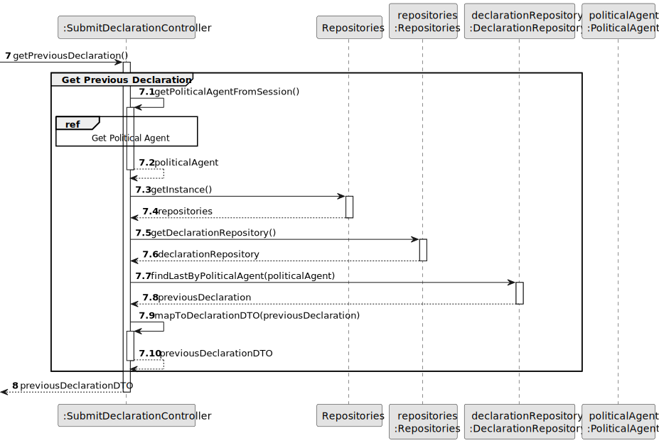

# US06 - Submit Declaration of Interests

## 3. Design

### 3.1. Rationale

| Interaction ID | Question: Which class is responsible for... | Answer | Justification |
|---|---|---|---|
| Step 1 | ... interacting with the Political Agent? | SubmitDeclarationUI | Pure Fabrication: there is no reason to assign this responsibility to any existing domain class. |
| Step 1 | ... coordinating the use case? | SubmitDeclarationController | Controller: coordinates the user story and delegates domain responsibilities. It acts as the frontier between the UI layer and the domain layer. |
| Step 2 | ... knowing the authenticated user? | ApplicationSession | Information Expert: it provides access to the current user session. |
| Step 2 | ... knowing the authenticated user's identifier? | UserSession | Information Expert: it owns the authenticated user's session data. |
| Step 3 | ... providing access to repositories? | Repositories | Pure Fabrication / Singleton: provides a central access point to the required repositories, avoiding direct coupling between the controller and individual repository instantiation. |
| Step 4 | ... finding the authenticated Political Agent? | PoliticalAgentRepository | Information Expert: it manages the collection of PoliticalAgent instances. |
| Step 5 | ... listing available Institutions? | InstitutionRepository | Information Expert: it manages the collection of registered Institution instances. |
| Step 5 | ... listing available Functions? | FunctionRepository | Information Expert: it manages the collection of registered Function instances. |
| Step 5.1 | ... mapping the Institution list to a list of InstitutionDTOs for the UI? | SubmitDeclarationController | Information Expert / DTO Pattern (T08): the controller holds the institutions list and is responsible for converting domain objects to DTOs before returning them to the UI layer. This decouples the UI from the domain model. The mapping is performed as a private controller operation since no additional behaviour or reuse is expected beyond this use case. |
| Step 5.2 | ... mapping the Function list to a list of FunctionDTOs for the UI? | SubmitDeclarationController | Information Expert / DTO Pattern (T08): same reasoning as Institution mapping — the controller converts Function domain objects to FunctionDTOs before returning them to the UI, maintaining layer decoupling. |
| Step 6 | ... finding the Political Agent's previous declaration, to support import (AC2)? | DeclarationRepository | Information Expert / Pure Fabrication: it manages the collection of Declaration instances and is the only class that can locate the most recent Declaration submitted by a given PoliticalAgent. |
| Step 7 | ... transporting declaration input data from the UI, including household members and the import/exceptional options? | DeclarationDTO | DTO (T08): reduces the number of method parameters and decouples UI input from the domain model. Using a DTO stabilises the method signature of `submitDeclaration()` regardless of future changes to the declaration structure. |
| Step 8 | ... creating a Declaration? | PoliticalAgent | Creator (GRASP): a PoliticalAgent submits, owns, and aggregates its Declarations (condition R1 — B contains/aggregates A). This is consistent with the composition relationship between PoliticalAgent and Declaration in the Class Diagram. The declaration is always created via `createDeclaration(declarationType)` from the final `DeclarationDTO` submitted by the UI. If previous data was imported, that data was already converted to editable DTO data before submission via `getPreviousDeclaration()`. |
| Step 8.1 | ... preparing previous declaration data for UI pre-fill (AC2)? | SubmitDeclarationController | DTO Pattern / Information Expert (T08): the Controller retrieves the previous Declaration through `DeclarationRepository.findLastByPoliticalAgent(politicalAgent)` and converts it into a `DeclarationDTO` via the private `mapToDeclarationDTO(previousDeclaration)` operation. The UI receives editable DTO data and the final submission follows the normal declaration creation flow, with no duplication of data. |
| Step 9 | ... creating and adding household members? | Declaration | Creator / Information Expert: Declaration contains and aggregates HouseholdMember instances (AC1). `addHouseholdMember(...)` validates each entry upon addition. |
| Step 10 | ... creating and adding declared financial items (positions, subsidies, assets, security holdings)? | Declaration | Creator / Information Expert: Declaration contains and aggregates Position, Subsidy, Asset and SecurityHolding items. It owns the data and validates each item upon addition. |
| Step 11 | ... recording the amendment reason and/or amended declaration reference for Exceptional declarations (AC6)? | Declaration | Information Expert: Declaration owns its `type`, `amendmentReason` and the optional self-association to the amended Declaration; `setAmendmentReason(...)` and `setAmendedDeclaration(...)` are only meaningful when `type == EXCEPTIONAL`, and this is enforced by `validateData()`. |
| Step 12 | ... validating declaration data globally, including AC1, AC4, AC5, AC6 and AC7? | Declaration and DeclarationRepository | Declaration (Information Expert) validates the structural rules it owns: AC1 (at least one household member), AC6 (amendment reason/reference present when EXCEPTIONAL), and AC7 (at least one financial entry). DeclarationRepository (Information Expert) is consulted by the Controller for the cross-declaration rules AC4 (`existsInitialDeclaration`) and AC5 (`existsRegularDeclarationForYear`), since these require knowledge of the PoliticalAgent's other declarations, which Declaration itself does not hold. |
| Step 13 | ... saving the submitted Declaration? | DeclarationRepository | Information Expert: it manages the collection of Declaration instances and is responsible for persistence. |
| Step 14 | ... informing operation success? | SubmitDeclarationUI | Pure Fabrication: responsible for user interaction and feedback. |

### Systematization

According to the taken rationale, the conceptual classes promoted to software classes are:

* PoliticalAgent
* Declaration
* HouseholdMember
* Position
* Subsidy
* Asset
* Location
* SecurityHolding
* Institution
* Function
* DeclarationType
* DeclarationStatus
* PositionType
* PropertyType
* HouseholdRelationship

Other software classes identified:

* SubmitDeclarationUI
* SubmitDeclarationController (includes private mapping operations: `mapToInstitutionDTOList`, `mapToFunctionDTOList`, `mapToDeclarationDTO` and `mapToLocation`)
* ApplicationSession
* UserSession
* Repositories
* PoliticalAgentRepository
* InstitutionRepository
* FunctionRepository
* DeclarationRepository
* DeclarationDTO
* HouseholdMemberDTO
* PositionDTO
* SubsidyDTO
* AssetDTO
* LocationDTO
* SecurityHoldingDTO
* InstitutionDTO
* FunctionDTO

---

## 3.2. Sequence Diagram (SD)

### Full Diagram

This diagram shows the full sequence of interactions between the classes involved in the realization of this user story.

### Split Diagrams

The following diagram shows the same sequence of interactions between the classes involved in the realization of this user story, but it is split in partial diagrams to better illustrate the interactions between the classes.

It uses Interaction Occurrence.

**Get Political Agent**

**Get Institutions**

**Get Functions**

**Get Previous Declaration**

**Create Declaration**

---

## 3.3. Class Diagram (CD)

---

## 3.4. Design Notes

- Each `add*` operation on Declaration (`addHouseholdMember`, `addPosition`, `addSubsidy`, `addAsset`,
  `addSecurityHolding`) validates the entry before adding it to the declaration.
- `validateData()` performs the final global validation, including AC1 (at least one household
  member), AC7 (at least one financial entry), and AC6 (an Exceptional declaration must have an
  amendment reason and/or an amended declaration reference).
- AC4 and AC5 (Initial declarations are unique per Political Agent; Regular declarations are limited
  to one per calendar year) are checked by the Controller via
  `DeclarationRepository.existsInitialDeclaration(politicalAgent)` and
  `DeclarationRepository.existsRegularDeclarationForYear(politicalAgent, year)`, before a Declaration
  of the corresponding type is created.
- Importing a previous declaration (AC2) is handled as UI pre-fill: the Controller retrieves the
  previous Declaration via `DeclarationRepository.findLastByPoliticalAgent(politicalAgent)` and
  converts it into a `DeclarationDTO` through `mapToDeclarationDTO(previousDeclaration)`. The
  Political Agent can edit the pre-filled data before confirming. The final submission always follows
  the normal creation flow via `PoliticalAgent.createDeclaration(declarationType)`, so no data
  duplication can occur. The new Declaration receives its own `submissionDate` and `status`
  (`SUBMITTED`).
- `Declaration.addAsset(propertyType, acquisitionValue, marketValue, location)` receives a domain
  `Location` value (built by the Controller from `LocationDTO`), never a `LocationDTO` directly — the
  Controller is responsible for translating `LocationDTO` into the domain representation before
  calling the domain layer, keeping `LocationDTO` confined to the DTO/UI boundary.