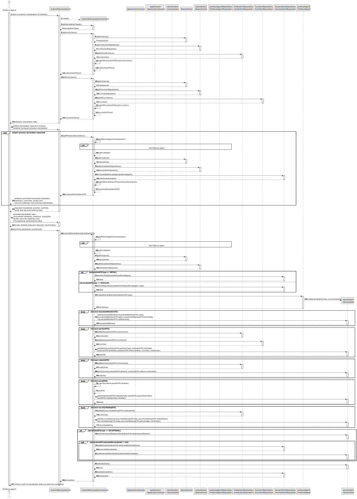
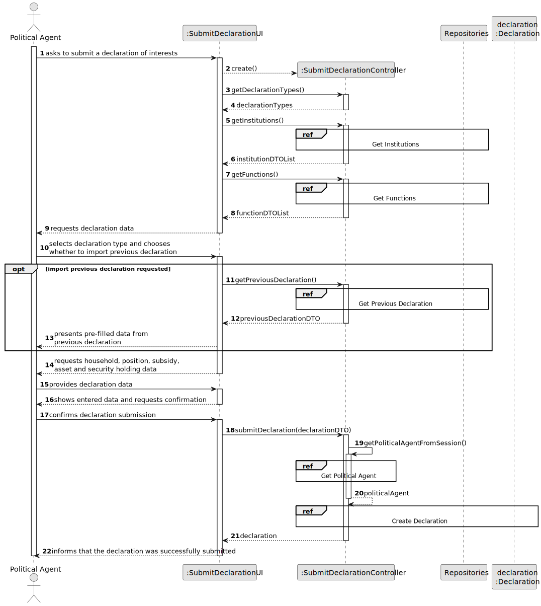
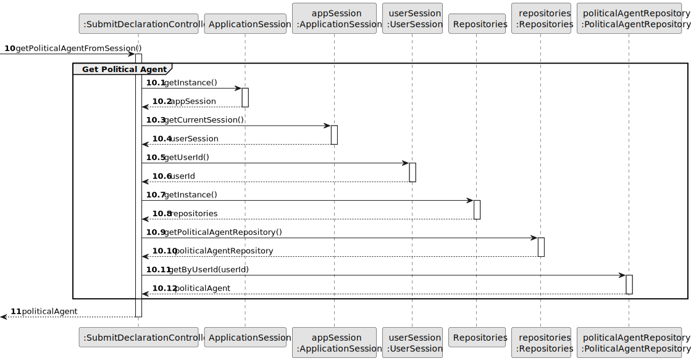
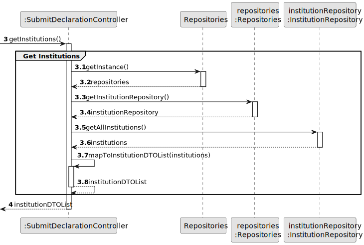
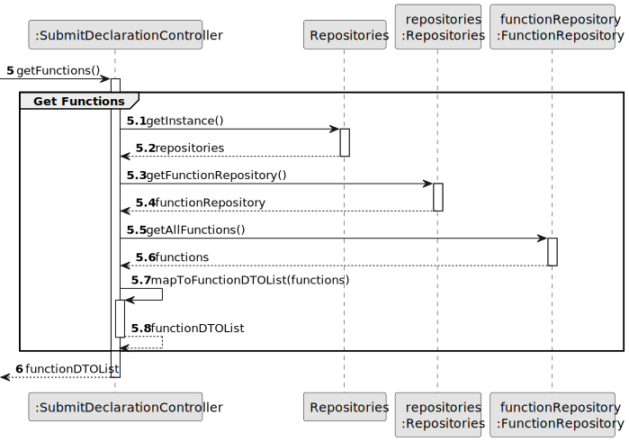
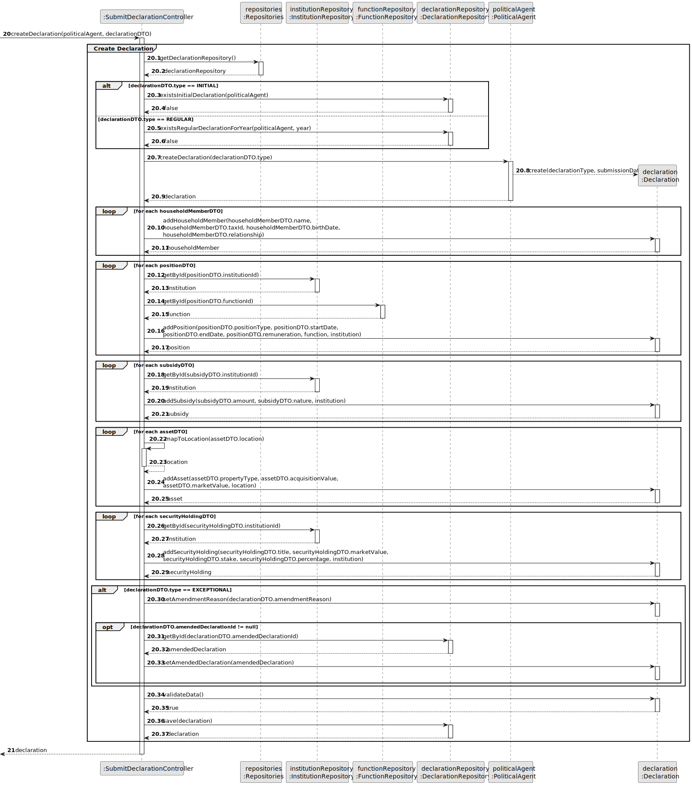
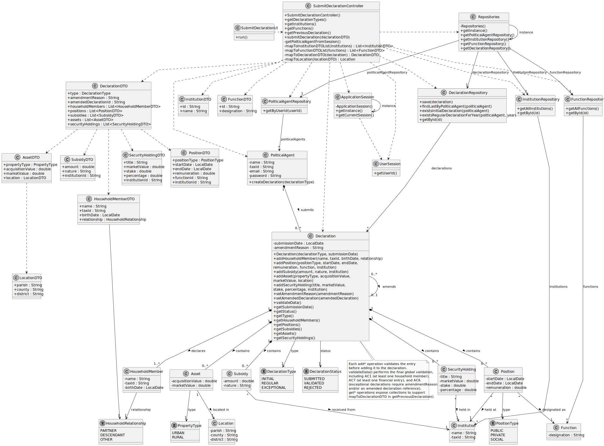

# US06 - Submit Declaration of Interests

## 3. Design

### 3.1. Rationale

| Interaction ID | Question: Which class is responsible for... | Answer | Justification |
|---|---|---|---|
| Step 1 | ... interacting with the Political Agent? | SubmitDeclarationUI | Pure Fabrication: there is no reason to assign this responsibility to any existing domain class. |
| Step 1 | ... coordinating the use case? | SubmitDeclarationController | Controller: coordinates the user story and delegates domain responsibilities. |
| Step 2 | ... knowing the authenticated user? | ApplicationSession | Information Expert: it provides access to the current user session. |
| Step 2 | ... knowing the authenticated user's identifier? | UserSession | Information Expert: it owns the authenticated user's session data. |
| Step 3 | ... providing access to repositories? | Repositories | Pure Fabrication / Singleton: provides a central access point to the required repositories. |
| Step 4 | ... finding the authenticated Political Agent? | PoliticalAgentRepository | Information Expert: it manages the collection of PoliticalAgent instances. |
| Step 5 | ... listing available Institutions? | InstitutionRepository | Information Expert: it manages the collection of registered Institution instances. |
| Step 5 | ... listing available Functions? | FunctionRepository | Information Expert: it manages the collection of registered Function instances. |
| Step 6 | ... transporting declaration input data from the UI? | DeclarationDTO | DTO: reduces the number of method parameters and decouples UI input from the domain model. |
| Step 7 | ... creating a Declaration? | PoliticalAgent | Creator: a PoliticalAgent submits and owns its Declarations. |
| Step 8 | ... creating and adding declared items? | Declaration | Creator / Information Expert: Declaration contains and manages Position, Subsidy, Asset and SecurityHolding items. |
| Step 9 | ... validating declaration data locally? | Declaration | Information Expert: it owns the declaration data and declared items. |
| Step 10 | ... saving the submitted Declaration? | DeclarationRepository | Information Expert: it manages Declaration instances. |
| Step 11 | ... informing operation success? | SubmitDeclarationUI | Pure Fabrication: responsible for user interaction and feedback. |

### Systematization

According to the taken rationale, the conceptual classes promoted to software classes are:

* PoliticalAgent
* Declaration
* Position
* Subsidy
* Asset
* Location
* SecurityHolding
* Institution
* Function
* DeclarationType
* DeclarationStatus
* PositionType
* PropertyType

Other software classes identified:

* SubmitDeclarationUI
* SubmitDeclarationController
* ApplicationSession
* UserSession
* Repositories
* PoliticalAgentRepository
* InstitutionRepository
* FunctionRepository
* DeclarationRepository
* DeclarationDTO
* PositionDTO
* SubsidyDTO
* AssetDTO
* LocationDTO
* SecurityHoldingDTO
* InstitutionDTO
* FunctionDTO

---

## 3.2. Sequence Diagram (SD)

### Full Diagram

This diagram shows the full sequence of interactions between the classes involved in the realization of this user story.

### Split Diagrams

The following diagram shows the same sequence of interactions between the classes involved in the realization of this user story, but it is split in partial diagrams to better illustrate the interactions between the classes.

It uses Interaction Occurrence.

**Get Political Agent**

**Get Institutions**

**Get Functions**

**Create Declaration**

---

## 3.3. Class Diagram (CD)

