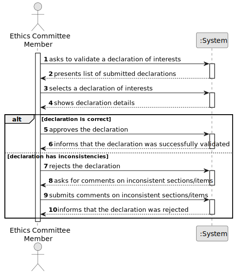

# US08 - Validate Declaration

## 1. Requirements Engineering

### 1.1. User Story Description

As a member of the Ethics Committee, I want to validate a submitted Declaration of Interests so that political agents 
are held accountable for the accuracy and completeness of their declarations.

---

### 1.2. Customer Specifications and Clarifications

**From the specifications document:**

> The Ethics Committee is responsible for managing and supervising the Declarations of Interests of political actors.

> When correct, the declaration is validated. When incorrect, the section/item with inconsistencies must be commented.

---

### 1.3. Acceptance Criteria

* **AC1:** When correct, it is validated.
* **AC2:** When incorrect, the section/item with inconsistencies must be commented.

---

### 1.4. Found out Dependencies

* There is a dependency on **US006 - Submit Declaration of Interests**, since a submitted declaration must exist before 
it can be validated.

---

### 1.5. Input and Output Data

**Input Data:**

* Selected data:
  * a submitted Declaration of Interests

* Typed data:
  * comments on inconsistent sections/items (when applicable)

**Output Data:**

* Declaration of Interests details
* Validation outcome (validated or rejected with comments)
* (In)Success of the operation

---

### 1.6. System Sequence Diagram (SSD)

---

### 1.7. Other Relevant Remarks

* Only members of the Ethics Committee can validate declarations.
* A rejected declaration is returned to the political agent with the committee member's comments for correction.