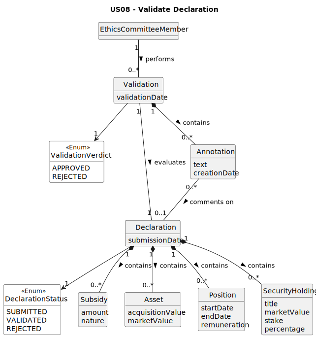

# US08 - Validate Declaration

## 2. Analysis

### 2.1. Relevant Domain Model Excerpt 

### 2.2. Other Remarks

The `Comment` is associated with `Section` rather than directly with `DeclarationOfInterests`, since AC2 specifies that 
inconsistencies must be commented at the section or item level, not on the declaration as a whole.

The multiplicity `0..1` on the `Section` side of the `Comment` association reflects that only sections containing 
inconsistencies will have comments — a correct section carries none.