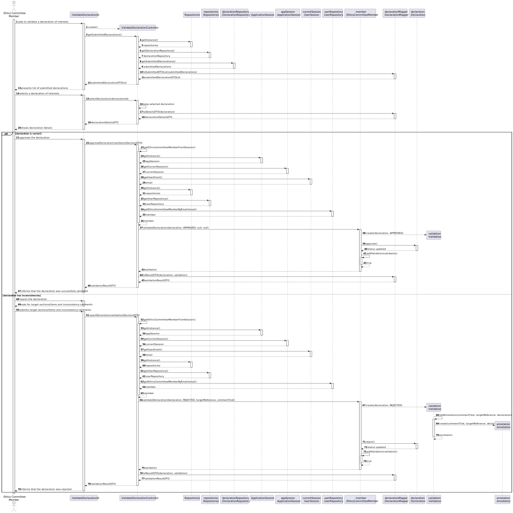
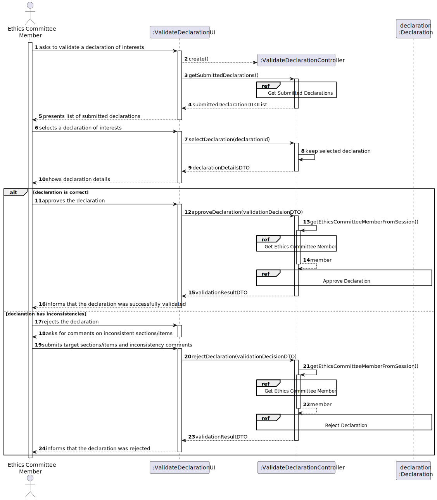
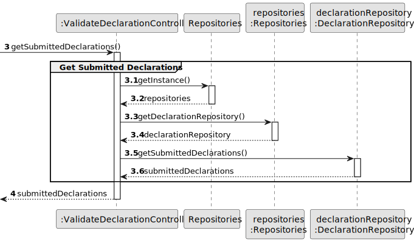
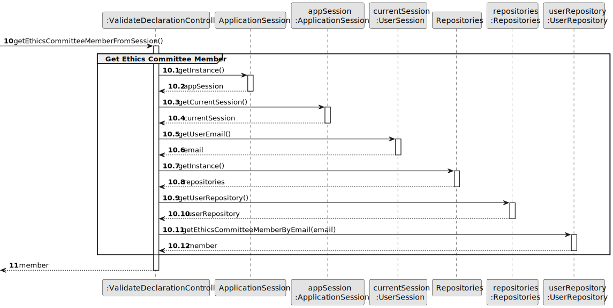
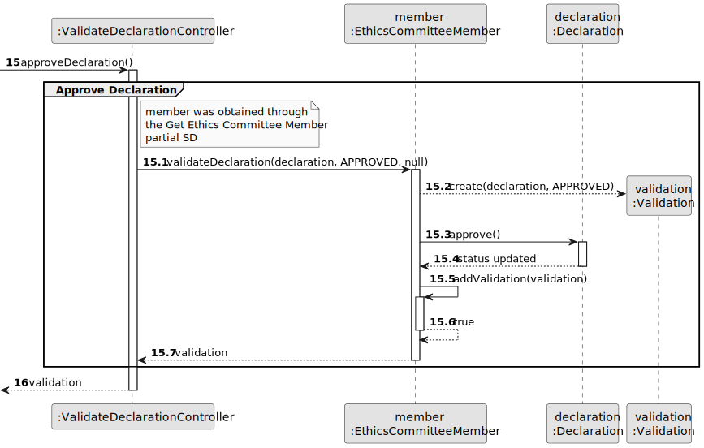
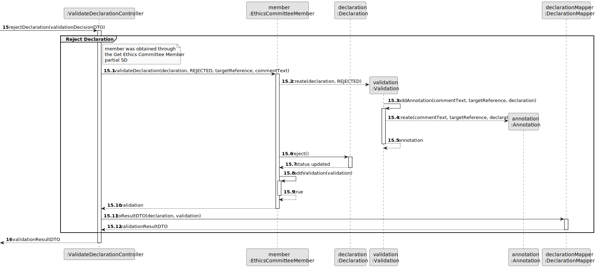
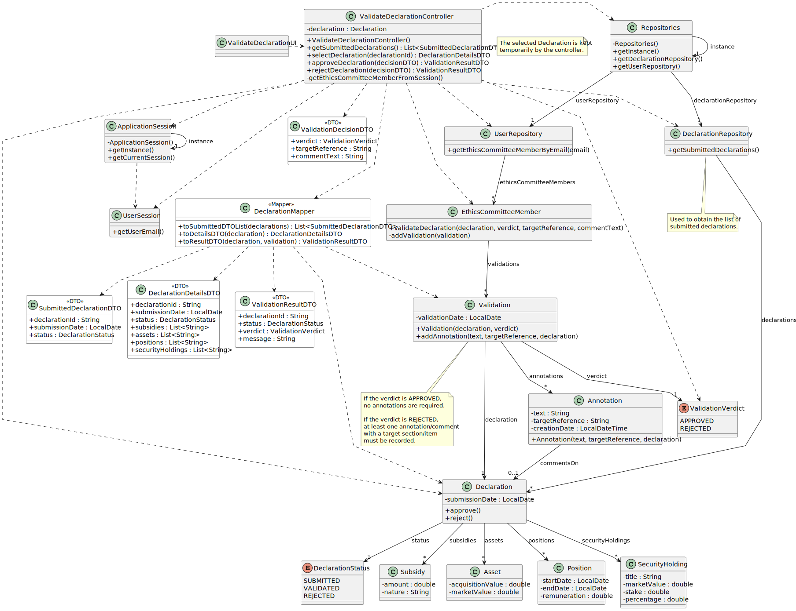

# US08 - Validate Declaration

## 3. Design

### 3.1. Rationale

| Interaction ID | Question: Which class is responsible for...                                  | Answer                        | Justification (with patterns)                                                                                                                         |
|:---------------|:-----------------------------------------------------------------------------|:------------------------------|:------------------------------------------------------------------------------------------------------------------------------------------------------|
| Step 1         | ... interacting with the actor?                                              | ValidateDeclarationUI         | Pure Fabrication: there is no reason to assign this responsibility to any existing class in the Domain Model.                                         |
|                | ... coordinating the US?                                                     | ValidateDeclarationController | Controller: coordinates the flow of this user story and acts as an intermediary between the UI and the domain/repository classes.                     |
|                | ... knowing all submitted declarations to show?                              | DeclarationRepository         | Information Expert: it keeps and manages Declaration instances.                                                                                       |
|                | ... preparing submitted declarations for the UI?                             | DeclarationMapper             | Mapper / DTO: exposes submitted declarations without coupling the UI to domain objects.                                                               |
|                | ... providing access to the declaration repository?                          | Repositories                  | Information Expert / Pure Fabrication: it provides access to the system repositories while keeping the controller decoupled from repository creation. |
| Step 2         | ... saving the selected declaration?                                         | ValidateDeclarationController | Information Expert: the controller keeps the selected declaration during the execution of the user story.                                             |
|                | ... showing the selected declaration details?                                | ValidateDeclarationUI         | Pure Fabrication: responsible for displaying information and interacting with the actor.                                                              |
|                | ... preparing selected declaration details for the UI?                       | DeclarationMapper             | Mapper / DTO: converts the selected declaration into a details DTO.                                                                                   |
|                | ... knowing the declaration details?                                         | Declaration                   | Information Expert: it owns the declaration data and its declared items.                                                                              |
| Step 3         | ... obtaining the Ethics Committee Member using the system?                  | ApplicationSession            | Information Expert: it knows the current user session.                                                                                                |
|                | ... knowing the email of the user using the system?                          | UserSession                   | Information Expert: it knows the authenticated user's email.                                                                                          |
|                | ... finding the Ethics Committee Member associated with the current session? | UserRepository                | Information Expert: it keeps and manages user instances.                                                                                              |
| Step 4         | ... validating the selected declaration?                                     | EthicsCommitteeMember         | Information Expert: it is the actor responsible for performing validations.                                                                           |
|                | ... carrying the validation decision from UI to controller?                  | ValidationDecisionDTO         | DTO: transfers the verdict and rejection data without exposing domain objects to the UI.                                                              |
|                | ... creating the Validation?                                                 | EthicsCommitteeMember         | Creator: in the Domain Model, an EthicsCommitteeMember performs Validations.                                                                          |
|                | ... recording the validation verdict?                                        | Validation                    | Information Expert: the verdict belongs to the validation act.                                                                                        |
|                | ... changing the declaration status when approved?                           | Declaration                   | Information Expert: it owns and manages its own lifecycle status.                                                                                     |
| Step 5         | ... rejecting the declaration?                                               | Declaration                   | Information Expert: it owns and manages its own lifecycle status.                                                                                     |
|                | ... creating comments when inconsistencies exist?                            | Validation                    | Creator: annotations exist in the context of a validation.                                                                                            |
|                | ... storing the comment text, target section/item and creation date?         | Annotation                    | Information Expert: it owns the annotation data and identifies the inconsistent declaration section/item being commented.                              |
|                | ... keeping the produced validation?                                         | EthicsCommitteeMember         | Information Expert: it performs and keeps its validations.                                                                                            |
|                | ... preparing the validation result for the UI?                              | DeclarationMapper             | Mapper / DTO: converts the validation result into a response DTO.                                                                                    |
| Step 6         | ... informing operation success?                                             | ValidateDeclarationUI         | Pure Fabrication: responsible for user interaction and feedback.                                                                                      |

### Systematization

According to the taken rationale, the conceptual classes promoted to software classes are:

* EthicsCommitteeMember
* Declaration
* Validation
* Annotation
* DeclarationStatus
* ValidationVerdict
* Subsidy
* Asset
* Position
* SecurityHolding

Other software classes identified:

* ValidateDeclarationUI
* ValidateDeclarationController
* Repositories
* DeclarationRepository
* UserRepository
* ApplicationSession
* UserSession
* SubmittedDeclarationDTO
* DeclarationDetailsDTO
* ValidationDecisionDTO
* ValidationResultDTO
* DeclarationMapper

---

## 3.2. Sequence Diagram (SD)

### Full Diagram

This diagram shows the full sequence of interactions between the classes involved in the realization of this user story.

### Split Diagrams

The following diagram shows the same sequence of interactions between the classes involved in the realization of this user story, but it is split in partial diagrams to better illustrate the interactions between the classes.

It uses Interaction Occurrence (a.k.a. Interaction Use).

**Get Submitted Declarations**

**Get Ethics Committee Member**

**Approve Declaration**

**Reject Declaration**

---

## 3.3. Class Diagram (CD)

