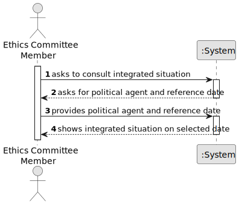

# US009 - Consult Integrated Situation of a Political Agent

## 1. Requirements Engineering

### 1.1. User Story Description

As a member of the Ethics Committee, I want to consult the Integrated Situation of a Political Agent on a given date.

### 1.2. Customer Specifications and Clarifications

**From the specifications document:**

> US09 - As a member of the Ethics Committee, I want to consult the Integrated Situation of a Political Agent on a given date.

> Analysis tools are designed to analyse declarations of interest from a temporal perspective to detect omissions, inconsistencies, and incompatibilities.

> The information provided varies depending on the type of user.

**From the client clarifications:**

> **Question:** What does "on a given date" mean in practice?
>
> **Answer:** The consultation uses a reference date and the system must present the integrated situation valid for that date.

> **Question:** Who can perform this consultation?
>
> **Answer:** Only authenticated users with the Ethics Committee role.

### 1.3. Acceptance Criteria

* **AC1:** The system must request a Political Agent and a reference date.
* **AC2:** The system must display the integrated situation for that Political Agent at the selected date.
* **AC3:** The operation is only available to authenticated users with the Ethics Committee role.

### 1.4. Found out Dependencies

* There is a dependency on **US06 - Submit declaration of interests**, because the integrated situation is based on declarations data.
* There is a dependency on authentication and role management (US01/US02 scope), because access must be limited to Ethics Committee members.

### 1.5 Input and Output Data

**Input Data:**

* Selected data:
    * Political Agent

* Typed data:
    * reference date

**Output Data:**

* Integrated Situation of the selected Political Agent for the given date.

### 1.6. System Sequence Diagram (SSD)

**_Other alternatives might exist._**

### 1.7 Other Relevant Remarks

* The consultation has a read-only nature.
* Date-based consistency is essential for temporal analysis.