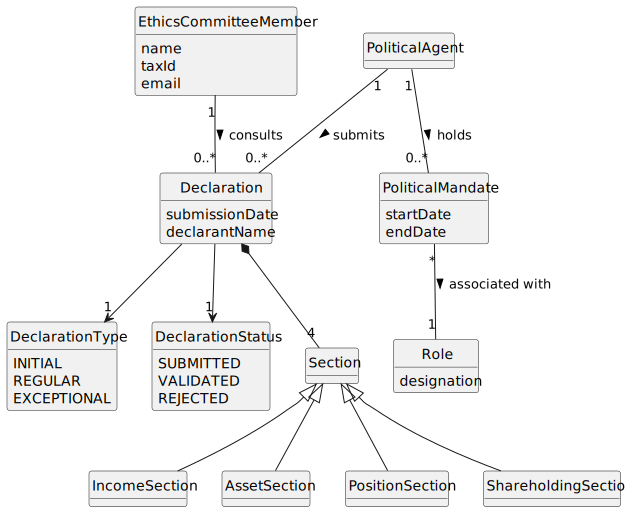

# US009 - Consult Integrated Situation of a Political Agent

## 2. Analysis

### 2.1. Relevant Domain Model Excerpt 

### 2.2. Other Remarks

The integrated situation is treated as a date-based consultation view over declarations submitted by a political agent.

The analysis emphasizes temporal consistency: data shown must correspond to the selected reference date.

The operation is restricted to authenticated users with the Ethics Committee role.