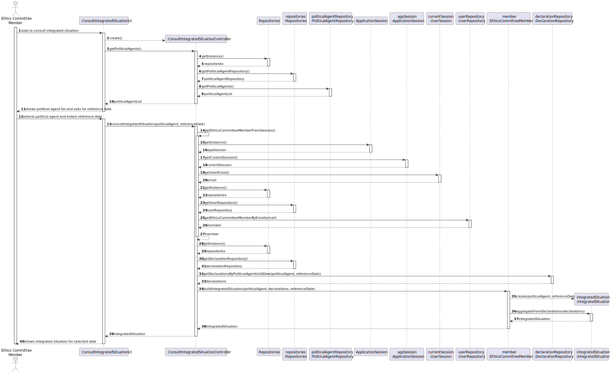
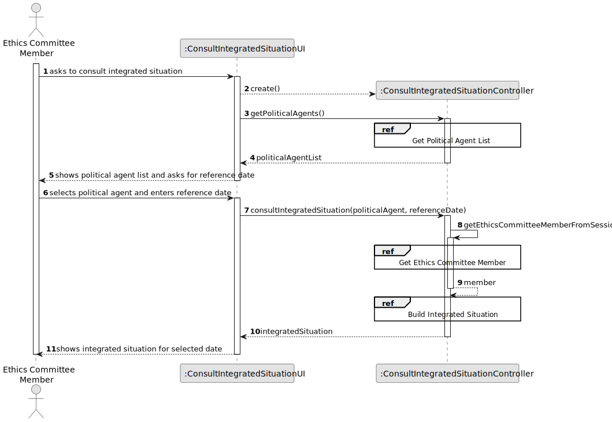
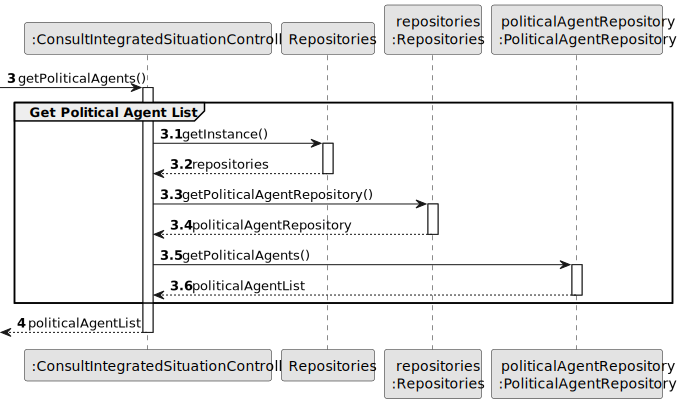
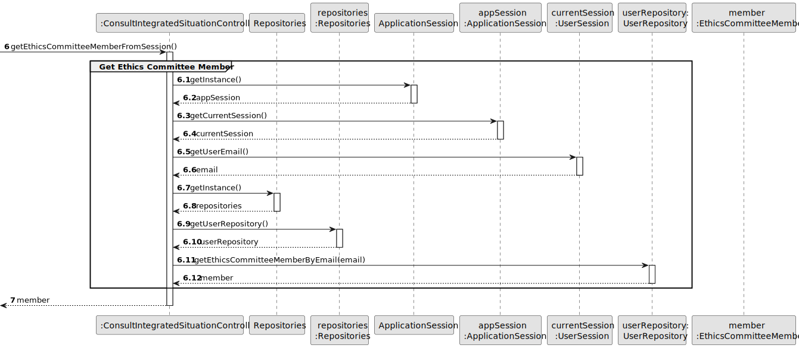
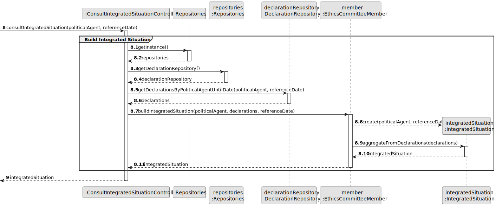
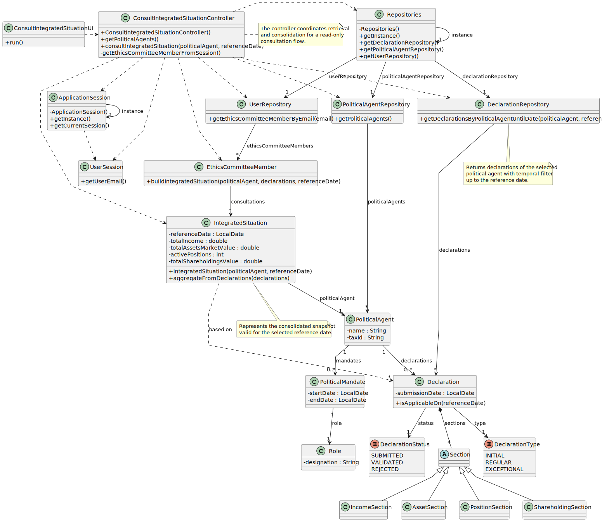

# US009 - Consult Integrated Situation of a Political Agent

## 3. Design

### 3.1. Rationale

| Interaction ID | Question: Which class is responsible for...                                     | Answer                             | Justification (with patterns)                                                                                                                                          |
|:---------------|:--------------------------------------------------------------------------------|:-----------------------------------|:-----------------------------------------------------------------------------------------------------------------------------------------------------------------------|
| Step 1         | ... interacting with the actor?                                                 | ConsultIntegratedSituationUI       | Pure Fabrication: there is no reason to assign this responsibility to any existing class in the Domain Model.                                                        |
|                | ... coordinating the US?                                                        | ConsultIntegratedSituationController | Controller: coordinates the flow of this user story and mediates between UI, repositories and domain objects.                                                        |
| Step 2         | ... knowing all political agents available to consult?                          | PoliticalAgentRepository           | Information Expert: it keeps and manages PoliticalAgent instances.                                                                                                     |
|                | ... providing access to repositories?                                           | Repositories                       | Information Expert / Pure Fabrication: centralizes repository access and reduces coupling in the controller.                                                         |
| Step 3         | ... obtaining the authenticated user from the current session?                  | ApplicationSession                 | Information Expert: it knows the current authenticated session.                                                                                                        |
|                | ... knowing the email of the authenticated user?                                | UserSession                        | Information Expert: it owns data about the current logged-in user.                                                                                                    |
|                | ... finding the ethics committee member associated with the current session?    | UserRepository                     | Information Expert: it stores and retrieves user instances by identity attributes (e.g., email).                                                                     |
| Step 4         | ... obtaining the declarations of the selected Political Agent valid for date?  | DeclarationRepository              | Information Expert: it keeps declarations and can query them by Political Agent and date constraints.                                                                |
| Step 5         | ... consolidating declarations into an integrated situation for the given date? | EthicsCommitteeMember              | Information Expert: this role executes oversight actions, including consulting and consolidating the agent situation for analysis.                                   |
|                | ... representing the consolidated result to be displayed?                       | IntegratedSituation                | Information Expert / Pure Fabrication: encapsulates the calculated snapshot for a reference date, decoupling presentation from raw declaration entities.             |
| Step 6         | ... informing operation success and presenting results?                         | ConsultIntegratedSituationUI       | Pure Fabrication: responsible for user interaction and feedback.                                                                                                      |

### Systematization

According to the taken rationale, the conceptual classes promoted to software classes are:

* EthicsCommitteeMember
* PoliticalAgent
* PoliticalMandate
* Role
* Declaration
* DeclarationType
* DeclarationStatus
* Section
* IncomeSection
* AssetSection
* PositionSection
* ShareholdingSection

Other software classes identified:

* ConsultIntegratedSituationUI
* ConsultIntegratedSituationController
* Repositories
* PoliticalAgentRepository
* DeclarationRepository
* UserRepository
* ApplicationSession
* UserSession
* IntegratedSituation

---

## 3.2. Sequence Diagram (SD)

### Full Diagram

This diagram shows the full sequence of interactions between the classes involved in the realization of this user story.

### Split Diagrams

The following diagram shows the same sequence of interactions between the classes involved in the realization of this user story, but it is split in partial diagrams to better illustrate the interactions between the classes.

It uses Interaction Occurrence (a.k.a. Interaction Use).

**Get Political Agent List**

**Get Ethics Committee Member**

**Build Integrated Situation**

---

## 3.3. Class Diagram (CD)

