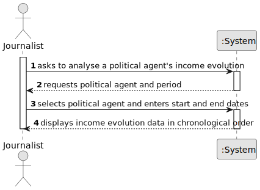

# US10 - Analyse Income Evolution of a Political Agent

## 1. Requirements Engineering

### 1.1. User Story Description

As a Journalist, I want to analyse the evolution of a Political Agent's
income over a given period of time (between two dates), so that I can
identify patterns, inconsistencies, or significant changes in their
declared earnings.

---

### 1.2. Customer Specifications and Clarifications

**From the specifications document:**

Income encompasses:
- remuneration received from professional positions (public, private,
  or social);
- support and subsidies received from institutions.

Declarations are submitted over time (initial, regular, exceptional),
creating a temporal record that supports longitudinal analysis.

**From the client clarifications:**

*(No clarifications available.)*

---

### 1.3. Acceptance Criteria

- **AC1:** The journalist must be a registered and authenticated user
  with the Journalist role.
- **AC2:** The journalist must select a registered Political Agent.
- **AC3:** The journalist must provide a valid start date and end date
  (start date must be before end date).
- **AC4:** The system must retrieve all declarations of the selected
  Political Agent within the specified period.
- **AC5:** For each declaration, the system must present the total
  income, considering remunerations and subsidies.
- **AC6:** Results must be presented in chronological order of
  submission date.
- **AC7:** If no declarations exist for the selected agent and period,
  the system must inform the journalist accordingly.

---

### 1.4. Found out Dependencies

- **US01** – The Journalist must be a registered user with the
  appropriate role.
- **US02** – The Journalist registration must have been accepted by
  an Administrator.
- **US06** – Declarations of Interests must have been submitted and
  stored to be available for analysis.
- **US08** – Validated declarations provide more reliable data for
  analysis.

---

### 1.5. Input and Output Data

**Input Data:**

*Selected data:*
- Political Agent (selected from registered agents)

*Typed data:*
- start date (beginning of analysis period)
- end date (end of analysis period)

**Output Data:**
- List of declarations within the period, each with:
  - submission date
  - declaration type
  - total remuneration from positions
  - total subsidy amounts
  - total income (sum of both)
- (In)success of the operation

---

### 1.6. System Sequence Diagram (SSD)

---

### 1.7. Other Relevant Remarks

- Income is a derived value computed from Position remunerations and
  Subsidy amounts stored within each Declaration.
- This US relies entirely on data produced by US06; no new data is
  captured here.
- The temporal dimension (between two dates) is central to this US and
  directly supports the transparency and oversight goals of the platform.