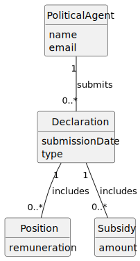

# US10 - OO Analysis

## 2.1. Relevant Domain Model Excerpt

This user story introduces no new conceptual classes. It relies entirely
on concepts already present in the domain model:

- **PoliticalAgent** – the subject of the analysis (introduced in US01/US02).
- **Declaration** – provides the temporal anchor; each declaration has a
  submission date that determines whether it falls within the requested
  period (introduced in US06).
- **Position** – provides the `remuneration` attribute that contributes
  to income (introduced in US06).
- **Subsidy** – provides the `amount` attribute that contributes to
  income (introduced in US06).

**Asset** and **Participation** are not relevant to income and are
therefore not involved in this use case.

---

## 2.2. Identified Conceptual Classes

| Category | Conceptual / Candidate Class |
|---|---|
| Roles of People or Organizations | PoliticalAgent (existing) |
| (Business) Transactions | Declaration (existing) |
| Transaction line items | Position (existing), Subsidy (existing) |

---

## 2.3. Identified Associations

| Concept A | Association | Concept B |
|---|---|---|
| PoliticalAgent | submits | Declaration |
| Declaration | includes | Position |
| Declaration | includes | Subsidy |

---

## 2.4. Identified Attributes (relevant to this US)

**Declaration**
- submissionDate *(used to filter by period)*
- type

**Position**
- remuneration *(contributes to income)*

**Subsidy**
- amount *(contributes to income)*

---

## 2.5. Domain Model

---

## 2.6. Remarks

- **No new classes:** This US is purely analytical — it queries and
  aggregates existing data. No new persistent concepts are identified.
- **Derived attribute:** Total income is a computed value (sum of
  remunerations + sum of subsidy amounts per declaration) and is
  therefore not stored as an attribute in the domain model.
- **Temporal filter:** The period defined by start date and end date
  operates on `Declaration.submissionDate`, which is already present
  in the model from US06.
- **Multiplicity justification:** A PoliticalAgent may have zero or more
  Declarations; a Declaration may have zero or more Positions and zero
  or more Subsidies, consistent with the model established in US06.
- **Subset of US06 model:** The domain model for this US is a
  projection of the US06 model, retaining only the concepts and
  attributes relevant to income analysis.
- **No model changes required:** This use case does not introduce new
  concepts or relationships, confirming the adequacy of the existing
  domain model from US06.