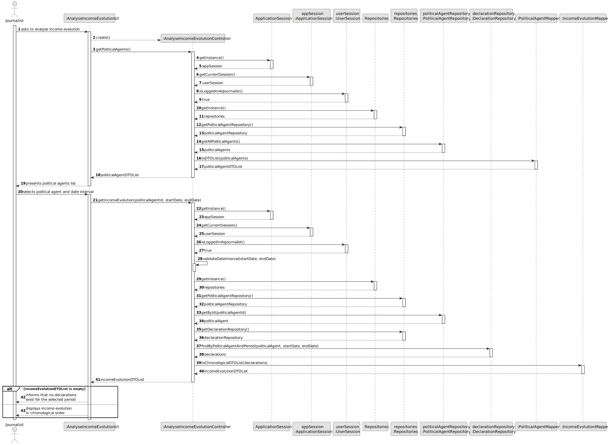
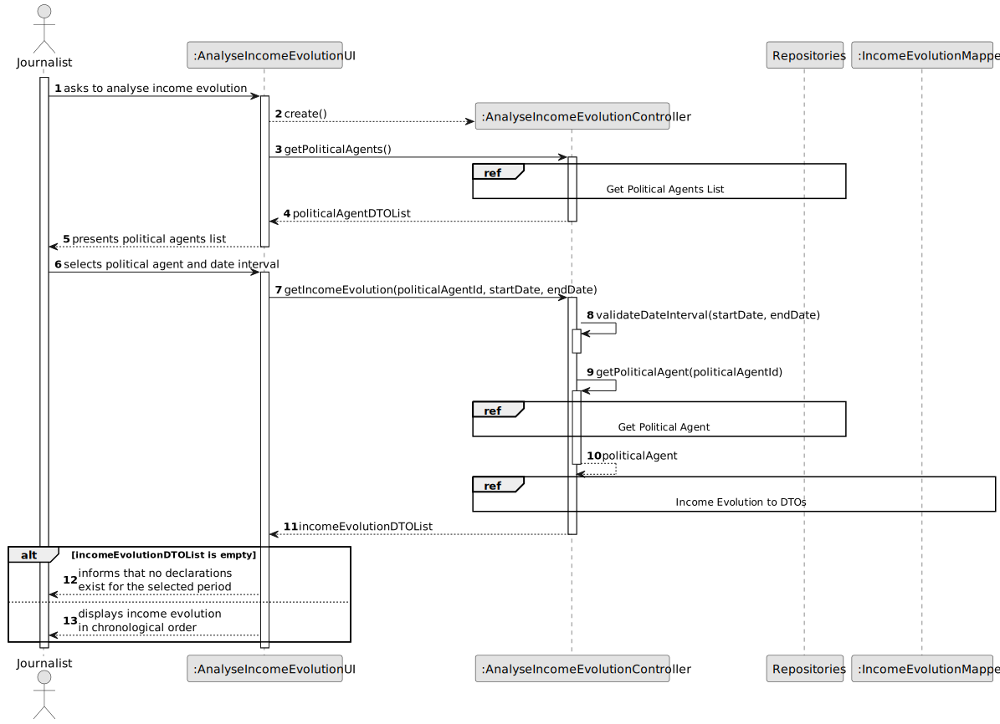
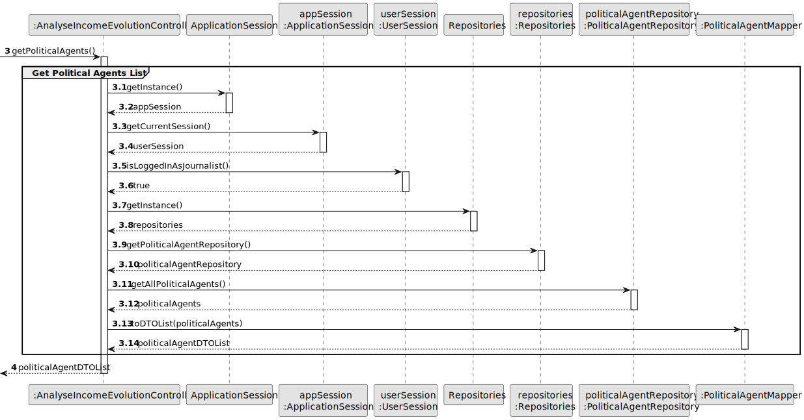
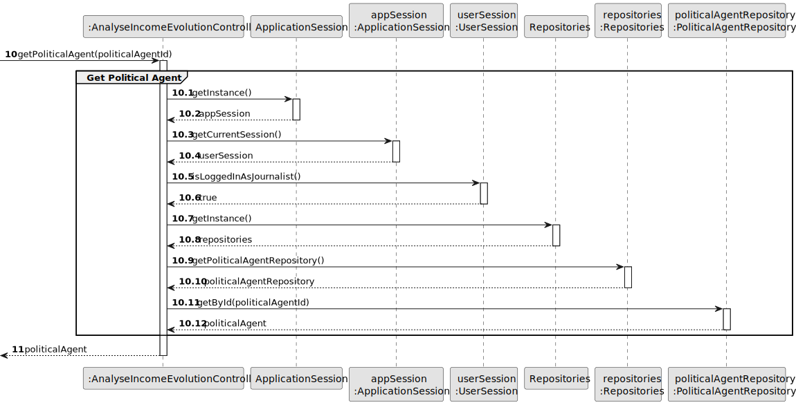
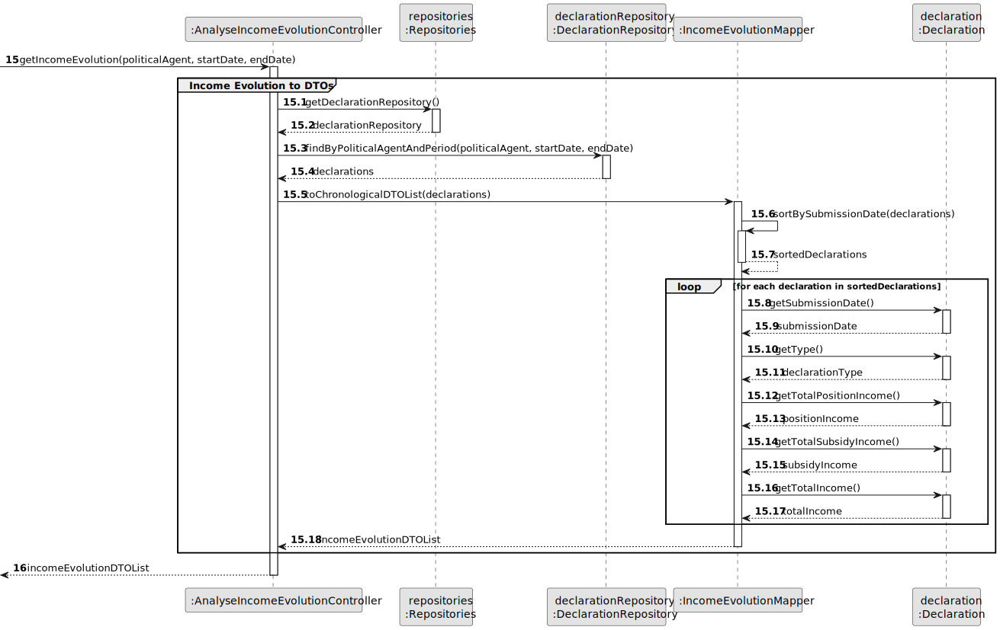
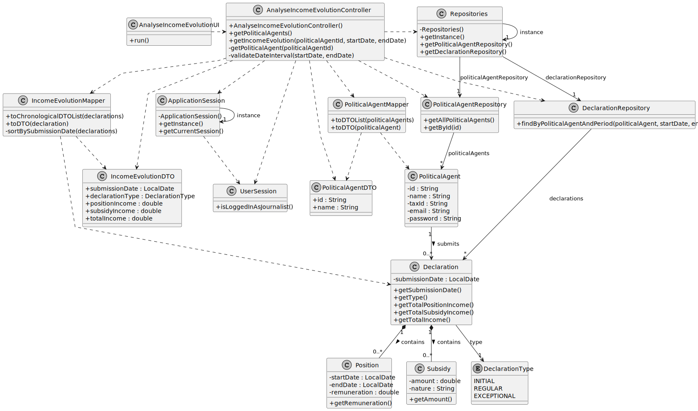

# US10 - Analyse Income Evolution of a Political Agent

## 3. Design

### 3.1. Rationale

| Interaction ID | Question: Which class is responsible for... | Answer | Justification |
|---|---|---|---|
| Step 1 | ... interacting with the Journalist? | AnalyseIncomeEvolutionUI | Pure Fabrication: there is no reason to assign this responsibility to any existing domain class. The UI only displays data carried by DTOs; it never receives domain objects directly. |
| Step 1 | ... coordinating the use case? | AnalyseIncomeEvolutionController | Controller: coordinates the user story and delegates responsibilities. The Controller orchestrates calls to repositories and mappers, but does not itself calculate income or order results. |
| Step 2 | ... checking the current session? | ApplicationSession | Information Expert: it provides access to the current session. |
| Step 2 | ... verifying that the current user is authenticated with the Journalist role? | UserSession | Information Expert: `isLoggedInAsJournalist()` owns the authenticated user's session data and role information. This check is performed both when listing Political Agents and when analysing income evolution (AC1). |
| Step 3 | ... providing access to repositories? | Repositories | Pure Fabrication / Singleton: centralises access to system repositories. |
| Step 4 | ... listing available Political Agents? | PoliticalAgentRepository | Information Expert: it manages the collection of PoliticalAgent instances (AC2). |
| Step 5 | ... transforming PoliticalAgent objects into DTOs for the UI? | PoliticalAgentMapper | Pure Fabrication: isolates mapping logic and reduces coupling between the UI and the domain. `toDTOList(politicalAgents)` converts the list returned by the repository into `PoliticalAgentDTO` instances, so the UI never handles `PoliticalAgent` domain objects directly. |
| Step 6 | ... finding the selected Political Agent? | PoliticalAgentRepository | Information Expert: it manages PoliticalAgent instances and can retrieve one by identifier (AC2). |
| Step 7 | ... finding Declarations in a given period? | DeclarationRepository | Information Expert: it manages Declaration instances and can query them by PoliticalAgent and date interval via `findByPoliticalAgentAndPeriod(politicalAgent, startDate, endDate)` (AC3, AC4). |
| Step 8 | ... calculating income values from a Declaration? | Declaration | Information Expert: it owns Positions and Subsidies and can calculate its own income values through `getTotalPositionIncome()`, `getTotalSubsidyIncome()` and `getTotalIncome()` (AC5). The Controller never performs these calculations itself, keeping income computation co-located with the data it depends on. |
| Step 9 | ... ordering declarations chronologically and transforming them into DTOs? | IncomeEvolutionMapper | Pure Fabrication: isolates mapping and ordering logic and prepares data for the UI. `toChronologicalDTOList(declarations)` is the single public entry point; it internally calls the private `sortBySubmissionDate(declarations)` before building the `IncomeEvolutionDTO` list (AC6). Neither the Controller nor the UI perform sorting directly. |
| Step 10 | ... transporting income evolution data to the UI? | IncomeEvolutionDTO | DTO: decouples the UI from the domain model. Each `IncomeEvolutionDTO` carries the submission date, declaration type, position income, subsidy income and total income for one declaration, pre-computed by `Declaration` and assembled by `IncomeEvolutionMapper`. |
| Step 11 | ... displaying the income evolution, or informing the journalist when no declarations exist? | AnalyseIncomeEvolutionUI | Pure Fabrication: responsible for user interaction and output, including the empty-result case (AC7). |

### Systematization

According to the taken rationale, the conceptual classes promoted to software classes are:

* PoliticalAgent
* Declaration
* Position
* Subsidy
* DeclarationType

Other software classes identified:

* AnalyseIncomeEvolutionUI
* AnalyseIncomeEvolutionController
* ApplicationSession
* UserSession
* Repositories
* PoliticalAgentRepository
* DeclarationRepository
* PoliticalAgentMapper
* IncomeEvolutionMapper
* PoliticalAgentDTO
* IncomeEvolutionDTO

---

## 3.2. Sequence Diagram (SD)

### Full Diagram

This diagram shows the full sequence of interactions between the classes involved in the realization of this user story.

### Split Diagrams

The following diagram shows the same sequence of interactions between the classes involved in the realization of this user story, but it is split in partial diagrams to better illustrate the interactions between the classes.

It uses Interaction Occurrence.

**Get Political Agents List**

**Get Political Agent**

**Income Evolution to DTOs**

---

## 3.3. Class Diagram (CD)

---

## 3.4. Design Notes

- `UserSession.isLoggedInAsJournalist()` is checked both when listing Political Agents
  (`getPoliticalAgents()`) and when analysing income evolution (`getIncomeEvolution(...)`), so neither
  operation can be reached by an unauthenticated user or a user without the Journalist role (AC1).
- The Controller never calculates income directly and never sorts results directly. These
  responsibilities belong to `Declaration` (income) and `IncomeEvolutionMapper` (chronological
  ordering and DTO assembly), following Information Expert and High Cohesion / Low Coupling.
- `IncomeEvolutionMapper.toChronologicalDTOList(declarations)` is the only mapping entry point used by
  the Controller; the previous, unordered `toDTOList(declarations)` is not part of this design, since
  AC6 requires the result to always be chronologically ordered.
- The UI only ever receives `PoliticalAgentDTO` and `IncomeEvolutionDTO` instances; it has no
  dependency on `PoliticalAgent`, `Declaration`, `Position` or `Subsidy`.