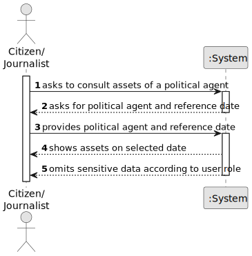

# US011 - Consult Assets of a Political Agent

## 1. Requirements Engineering

### 1.1. User Story Description

As a citizen/journalist, I want to consult the assets of a political agent on a specific date.

### 1.2. Customer Specifications and Clarifications

**From the specifications document:**

> US11 - As a citizen/journalist, I want to consult the assets of a political agent on a specific date.

> AC1: Sensitive data must be partially omitted based on the user's role.

> The information provided varies depending on the type of user.

**From the client clarifications:**

> **Question:** Which users can access this consultation?
>
> **Answer:** Citizen and Journalist users can perform this consultation, with role-based visibility rules.

> **Question:** What does "on a specific date" mean?
>
> **Answer:** The consultation must use a reference date and return the assets valid on that date.

### 1.3. Acceptance Criteria

* **AC1:** Sensitive data must be partially omitted based on the user's role.
* **AC2:** The system must request a Political Agent and a reference date.
* **AC3:** The system must present the assets associated with that Political Agent on the selected date.

### 1.4. Found out Dependencies

* There is a dependency on **US06 - Submit declaration of interests**, because assets are sourced from submitted declarations.
* There is a dependency on authentication/authorization, because data visibility differs by user role.

### 1.5 Input and Output Data

**Input Data:**

* Selected data:
    * Political Agent

* Typed data:
    * reference date

**Output Data:**

* Assets of the selected Political Agent on the selected date.
* Partial omission of sensitive data according to the role of the authenticated user.

### 1.6. System Sequence Diagram (SSD)

**_Other alternatives might exist._**

### 1.7 Other Relevant Remarks

* This is a read-only consultation operation.
* Role-based information filtering must be applied consistently before presenting results.