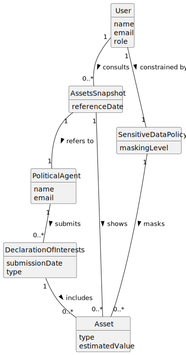

# US011 - Consult Assets of a Political Agent

## 2. Analysis

### 2.1. Relevant Domain Model Excerpt 

### 2.2. Other Remarks

The consultation is modeled as a date-based snapshot of a Political Agent's assets.

The snapshot is derived from declarations of interests and must reflect only the data valid on the selected reference date.

Access behavior is role-dependent (Citizen/Journalist), and sensitive fields must be partially omitted before presenting results.

This is a read-only operation focused on transparency while preserving confidentiality constraints.