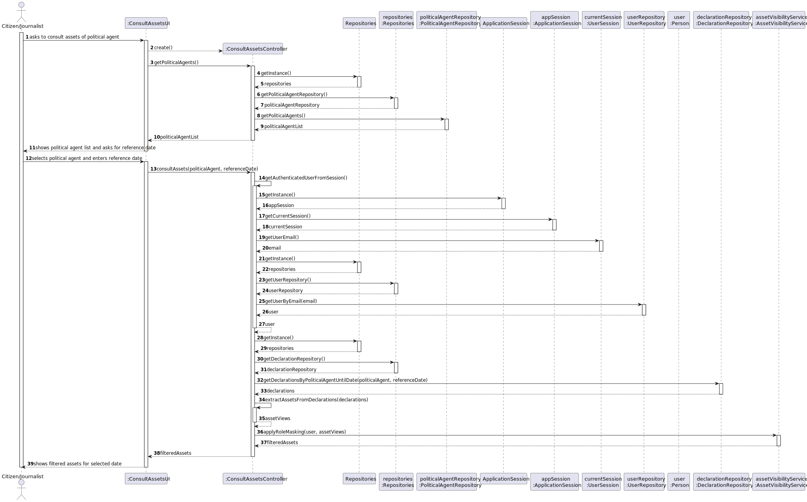
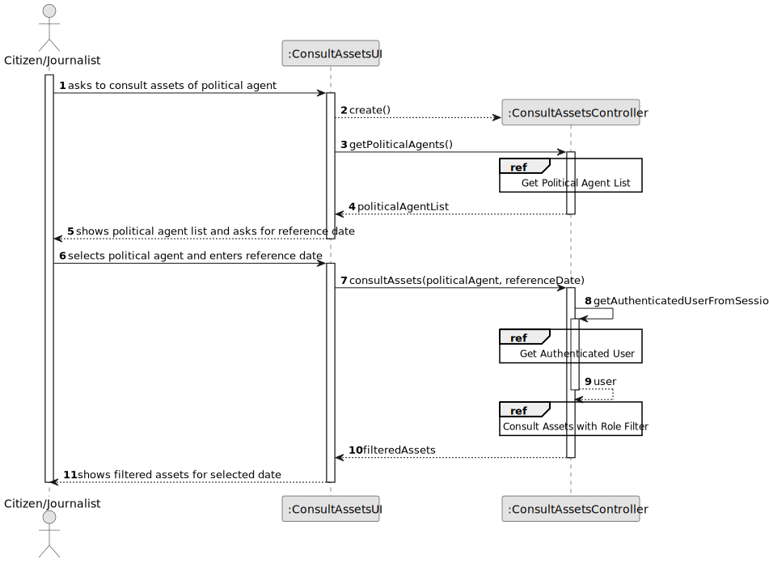
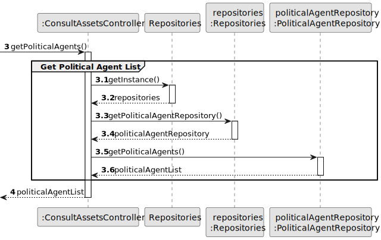
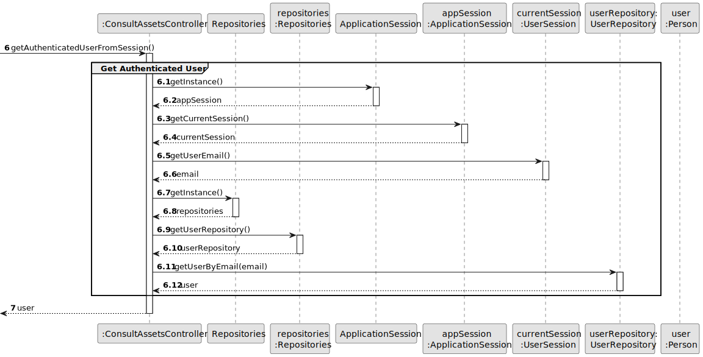
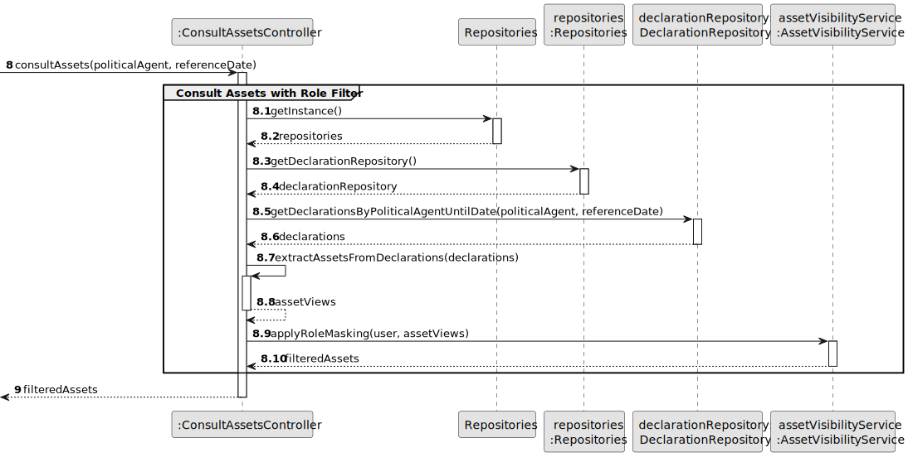
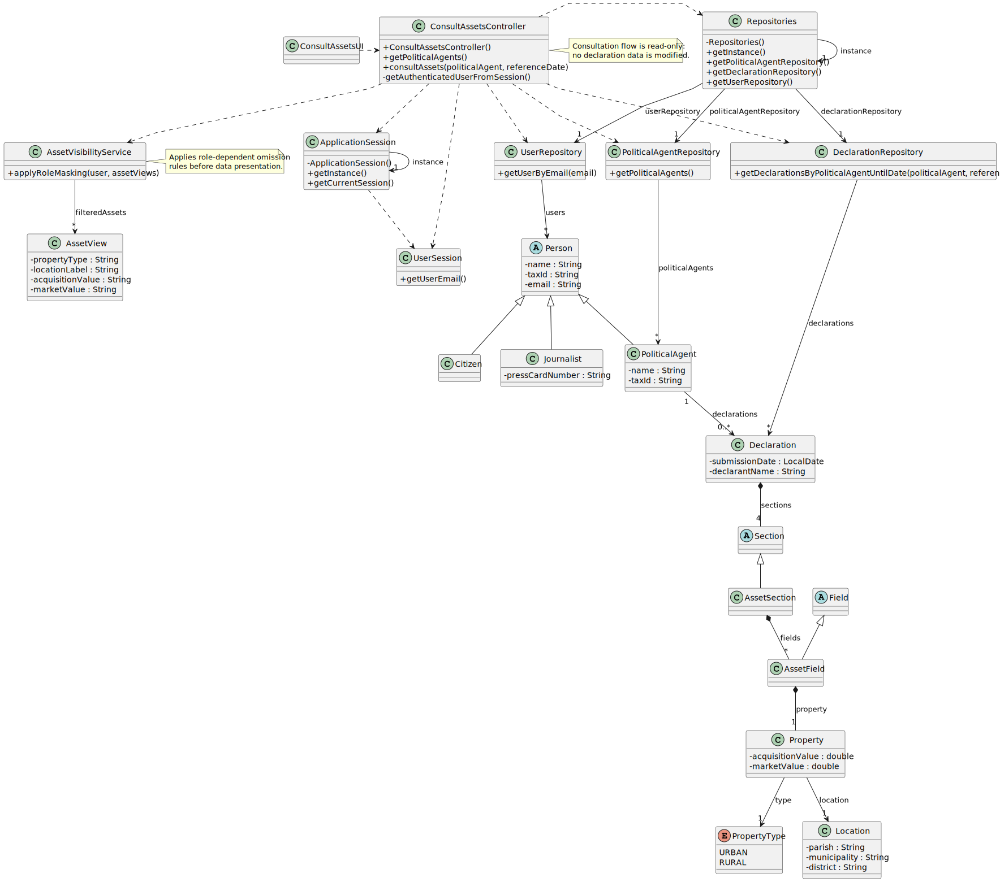

# US011 - Consult Assets of a Political Agent

## 3. Design

### 3.1. Rationale

| Interaction ID | Question: Which class is responsible for...                                  | Answer                           | Justification (with patterns)                                                                                                                                          |
|:---------------|:-----------------------------------------------------------------------------|:---------------------------------|:-----------------------------------------------------------------------------------------------------------------------------------------------------------------------|
| Step 1         | ... interacting with the actor?                                              | ConsultAssetsUI                  | Pure Fabrication: there is no reason to assign this responsibility to an existing domain class.                                                                       |
|                | ... coordinating the US?                                                     | ConsultAssetsController          | Controller: coordinates the user story flow and mediates UI, repositories, and role-based filtering.                                                                 |
| Step 2         | ... knowing all political agents available to consult?                       | PoliticalAgentRepository         | Information Expert: repository stores and retrieves PoliticalAgent instances.                                                                                          |
|                | ... providing access to repositories?                                        | Repositories                     | Information Expert / Pure Fabrication: central repository access point that reduces coupling in controllers.                                                          |
| Step 3         | ... obtaining the authenticated user from session?                           | ApplicationSession               | Information Expert: it knows the current authenticated session.                                                                                                        |
|                | ... knowing the email of the authenticated user?                             | UserSession                      | Information Expert: it stores authenticated user identity attributes.                                                                                                  |
|                | ... finding the user role (Citizen or Journalist) from that identity?        | UserRepository                   | Information Expert: retrieves users by identity, enabling role-based filtering logic.                                                                                 |
| Step 4         | ... obtaining declarations of the selected political agent for a given date? | DeclarationRepository            | Information Expert: stores declarations and supports temporal queries by agent and date.                                                                              |
| Step 5         | ... extracting and assembling asset data to present?                         | ConsultAssetsController          | Controller: orchestrates extraction from declaration sections and prepares read-only view data for the UI.                                                            |
| Step 6         | ... applying role-based omission of sensitive asset data?                    | AssetVisibilityService           | Pure Fabrication / Protected Variations: encapsulates visibility policies so role rules are isolated from controller and domain entities.                            |
| Step 7         | ... informing operation success and presenting filtered assets?              | ConsultAssetsUI                  | Pure Fabrication: responsible for user interaction and feedback.                                                                                                      |

### Systematization

According to the taken rationale, the conceptual classes promoted to software classes are:

* PoliticalAgent
* Declaration
* Section
* AssetSection
* Field
* AssetField
* Property
* PropertyType
* Location
* Citizen
* Journalist

Other software classes identified:

* ConsultAssetsUI
* ConsultAssetsController
* AssetVisibilityService
* AssetView
* Repositories
* PoliticalAgentRepository
* DeclarationRepository
* UserRepository
* ApplicationSession
* UserSession

---

## 3.2. Sequence Diagram (SD)

### Full Diagram

This diagram shows the full sequence of interactions between the classes involved in the realization of this user story.

### Split Diagrams

The following diagram shows the same sequence of interactions between the classes involved in the realization of this user story, but it is split in partial diagrams to better illustrate the interactions between the classes.

It uses Interaction Occurrence (a.k.a. Interaction Use).

**Get Political Agent List**

**Get Authenticated User**

**Consult Assets with Role Filter**

---

## 3.3. Class Diagram (CD)

