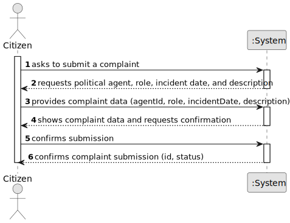

# US12 - Submit Complaint

## 1. Requirements Engineering

### 1.1. User Story Description

As a citizen, I want to make a complaint about a political agent in a specific role and on a specific date.

### 1.2. Customer Specifications and Clarifications

**From the specifications document:**

> US12 - As a citizen, I want to make a complaint about a political agent in a specific role and on a specific date.

> The platform may be used by ordinary citizens to report behavior and processes they consider to be lacking in transparency.

**From client clarifications (working assumptions):**

> **Question:** What is the minimum mandatory data to register a complaint?
>
> **Answer:** Political agent, role, complaint date, and a textual description of the complaint.

> **Question:** Can the complaint date be in the future?
>
> **Answer:** No. A complaint date must be on or before the current date.

### 1.3. Acceptance Criteria

* **AC1:** A complaint must include political agent, role, date, and complaint description.
* **AC2:** The complaint date cannot be in the future.
* **AC3:** A successful operation stores the complaint with a unique identifier and status `SUBMITTED`.
* **AC4:** Only authenticated users with the Citizen role can execute this use case.

### 1.4. Found out Dependencies

* Dependency on **US01/US02** for registration and platform access control.
* Dependency on political agent and role master data (used across Sprint 1 use cases).

### 1.5 Input and Output Data

**Input Data:**

* Selected data:
  * political agent
  * political role

* Typed data:
  * complaint date
  * complaint description

**Output Data:**

* complaint identifier
* complaint status
* operation (in)success feedback

### 1.6. System Sequence Diagram (SSD)

### 1.7 Other Relevant Remarks

* The complaint is registered by a citizen and should be auditable.
* Sensitive personal data must be handled according to applicable privacy rules.