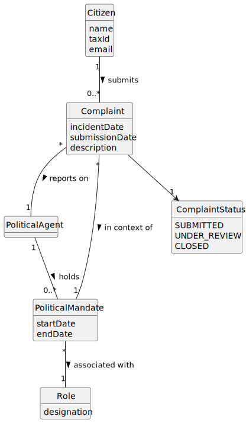

# US12 - Submit Complaint

## 2. Analysis

### 2.1. Relevant Domain Model Excerpt

### 2.2. Other Remarks

* Complaint is the core domain concept in this user story.
* Each complaint must reference exactly one PoliticalAgent and one PoliticalMandate that defines the contextual role at the reported time.
* Citizen is the actor considered in this user story for complaint submission.
* Incident date must satisfy the invariant: incidentDate <= today.
* Complaint lifecycle starts with status SUBMITTED and can later evolve in future user stories.
