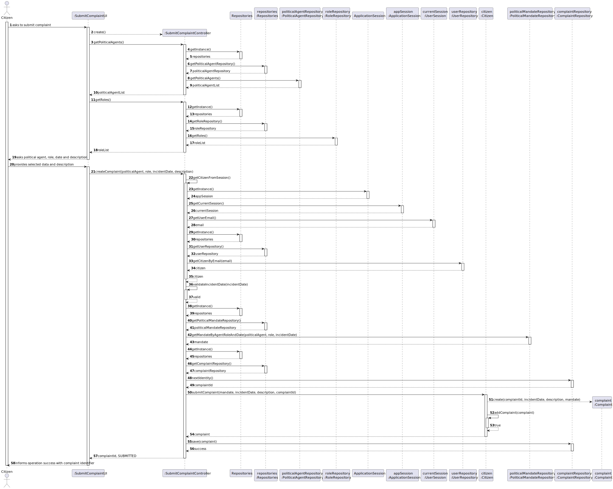
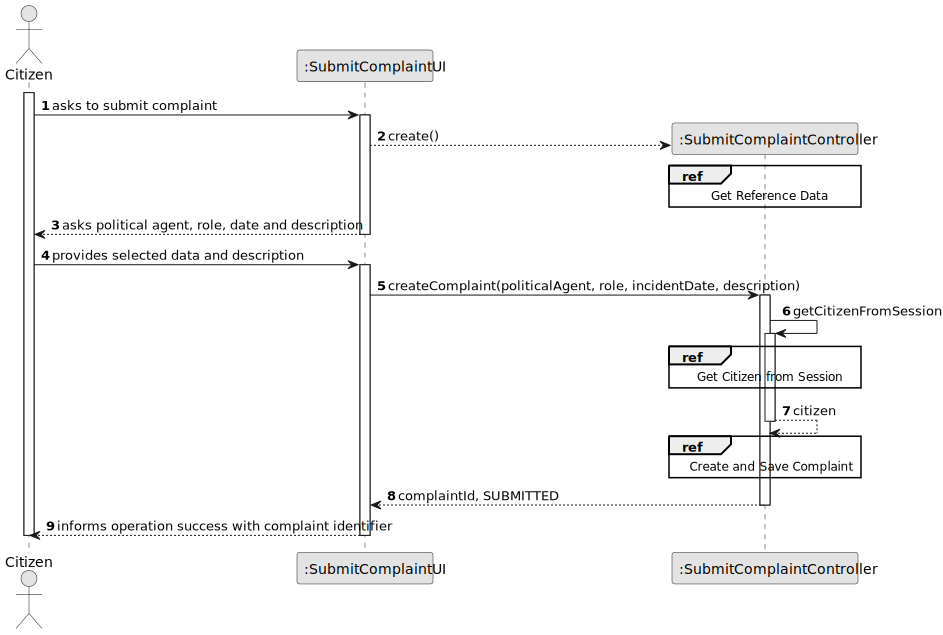
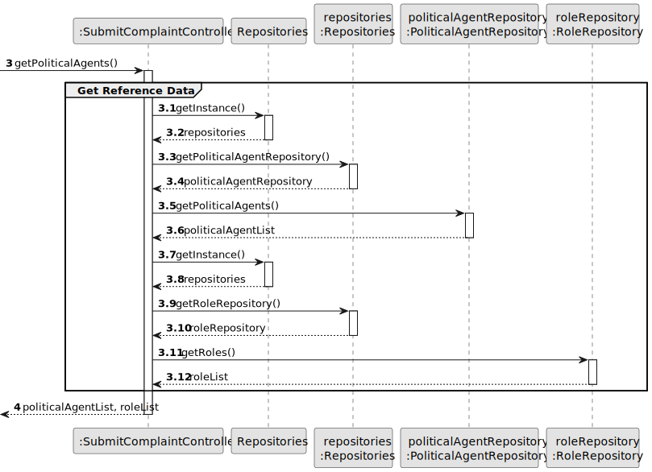
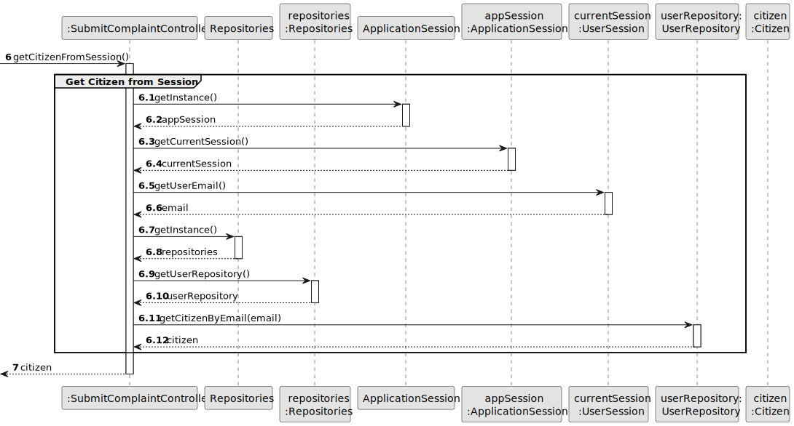
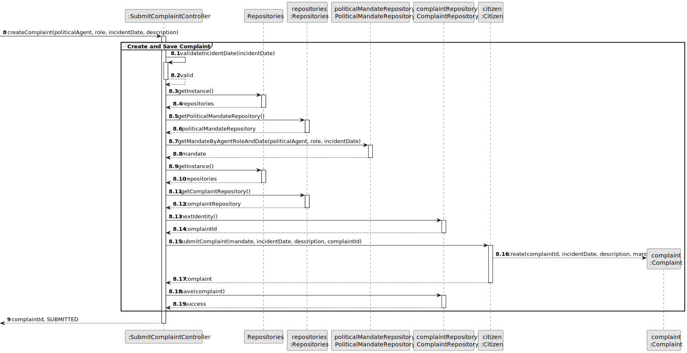
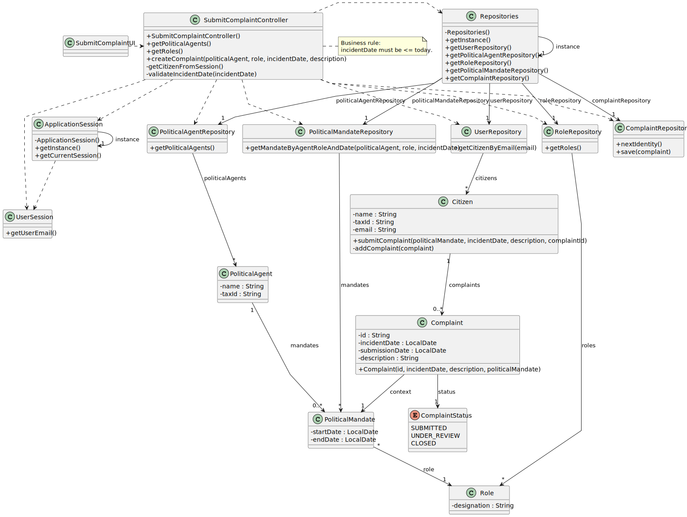

# US12 - Submit Complaint

## 3. Design

### 3.1. Rationale

| Interaction ID | Question: Which class is responsible for...                                    | Answer                     | Justification (with patterns)                                                                                                                                          |
|:---------------|:-------------------------------------------------------------------------------|:---------------------------|:-----------------------------------------------------------------------------------------------------------------------------------------------------------------------|
| Step 1         | ... interacting with the actor?                                                | SubmitComplaintUI          | Pure Fabrication: user interaction concerns should not be assigned to domain entities.                                                                                |
|                | ... coordinating the US?                                                       | SubmitComplaintController  | Controller: coordinates UI flow, validations, and domain/repository interactions.                                                                                     |
| Step 2         | ... knowing available political agents and roles for selection?                | PoliticalAgentRepository   | Information Expert: stores/retrieves PoliticalAgent instances.                                                                                                        |
|                |                                                                                | RoleRepository             | Information Expert: stores/retrieves Role instances.                                                                                                                  |
|                | ... providing repository access?                                               | Repositories               | Information Expert / Pure Fabrication: centralizes repository retrieval and reduces coupling.                                                                         |
| Step 3         | ... obtaining authenticated user from current session?                         | ApplicationSession         | Information Expert: it knows the current authenticated session.                                                                                                        |
|                | ... knowing authenticated user email?                                          | UserSession                | Information Expert: stores identity data for the current session.                                                                                                     |
|                | ... retrieving the Citizen associated with session?                            | UserRepository             | Information Expert: retrieves user entities by identity (email).                                                                                                      |
| Step 4         | ... validating complaint date is not in the future?                            | SubmitComplaintController  | Controller: enforces use-case rule before creating domain objects.                                                                                                    |
| Step 5         | ... finding mandate context by agent, role, and date?                          | PoliticalMandateRepository | Information Expert: manages PoliticalMandate entities and contextual retrieval by agent/role/date.                                                                    |
| Step 6         | ... creating complaint with status SUBMITTED and unique id?                    | Citizen                    | Creator / Information Expert: citizen submits complaint; complaint belongs to this action context.                                                                    |
|                |                                                                                | ComplaintRepository        | Information Expert: provides next identifier and stores complaint records.                                                                                             |
| Step 7         | ... informing operation success?                                               | SubmitComplaintUI          | Pure Fabrication: responsible for user interaction feedback.                                                                                                          |

### Systematization

According to the taken rationale, the conceptual classes promoted to software classes are:

* Citizen
* PoliticalAgent
* Role
* PoliticalMandate
* Complaint
* ComplaintStatus

Other software classes identified:

* SubmitComplaintUI
* SubmitComplaintController
* Repositories
* UserRepository
* PoliticalAgentRepository
* RoleRepository
* PoliticalMandateRepository
* ComplaintRepository
* ApplicationSession
* UserSession

---

## 3.2. Sequence Diagram (SD)

### Full Diagram

This diagram shows the full sequence of interactions between the classes involved in the realization of this user story.

### Split Diagrams

The following diagram shows the same sequence of interactions between the classes involved in the realization of this user story, but it is split in partial diagrams to better illustrate the interactions between the classes.

It uses Interaction Occurrence (a.k.a. Interaction Use).

**Get Reference Data**

**Get Citizen from Session**

**Create and Save Complaint**

---

## 3.3. Class Diagram (CD)

