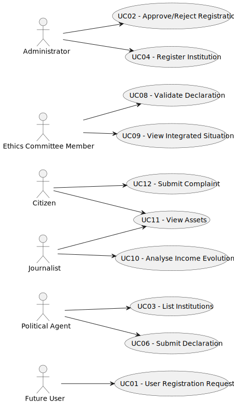

# Use Case Diagram (UCD)

**In the scope of this project, there is a direct relationship of _1 to 1_ between Use Cases (UC) and User Stories (US).**

However, be aware, this is a pedagogical simplification. On further projects and course units there may also exist _1 to N **and/or** N to 1_ relationships between UC and US.

**Insert below the Use Case Diagram in a SVG format**

**For each UC/US, it must be provided evidences of applying main activities of the software development process (requirements, analysis, design, tests and code). Gather those evidences on a separate file for each UC/US and set up a link as suggested below.**

# Use Cases / User Stories

| UC/US | Description                                              |                   
|:------|:---------------------------------------------------------|
| US01  | [User Registration Request](../../US01/US01-README.md)   |
| US02  | [Approve/Reject Registration](../../US02/US02-README.md) |
| US03  | [List Institutions](../../US03/US03-README.md)           |
| US04  | [Register Institution](../../US04/US04-README.md)        |
| US06  | [Submit Declaration of Interests](../../US06/US06-README.md)         |
| US08  | [Validate Declaration](../../US08/US08-README.md)        |
| US09  | [View Integrated Situation](../../US09/US09-README.md)   |
| US10  | [Analyse Income Evolution](../../US10/US10-README.md)    |
| US11  | [View Assets](../../US11/US11-README.md)                 |
| US12  | [Submit Complaint](../../US12/US12-README.md)            |

