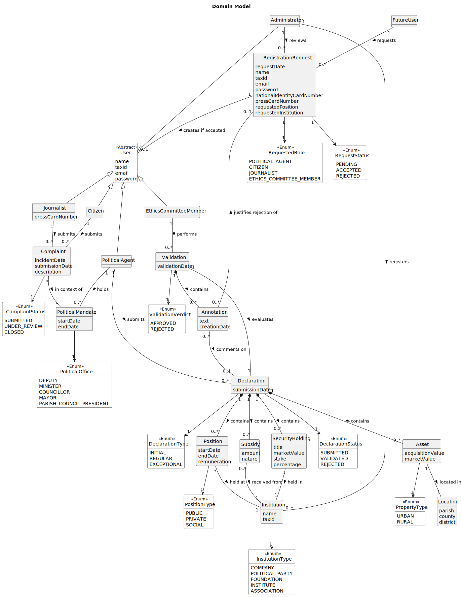

# OO Analysis

The construction process of the domain model is based on the client specifications, especially the nouns (for
_concepts_) and verbs (for _relations_) used.

## Rationale to identify domain conceptual classes
To identify domain conceptual classes, start by making a list of candidate conceptual classes inspired by the list of 
categories suggested in the book "Applying UML and Patterns: An Introduction to Object-Oriented Analysis and Design and 
Iterative Development".

### _Conceptual Class Category List_

**Business Transactions**

* RegistrationRequest — the formal act by which a user requests access to the platform with a specific role. It has a 
lifecycle (pending, accepted, rejected) and must be reviewed by an Administrator. It is a transaction because it 
represents an interaction between a user and the system that produces a change in state — the user either gains or is 
denied access.

* Validation — the formal act by which an Ethics Committee Member evaluates a submitted Declaration of Interests. It 
produces a verdict (approved or rejected) and may contain one or more Annotations targeting specific items. It is a 
transaction because it represents a deliberate, recorded decision with legal implications, and its outcome directly 
changes the Declaration's status.

---

**Transaction Line Items**

* Annotation — a specific comment produced during a Validation, targeting a particular declared item (Subsidy, Asset, 
Position or SecurityHolding). It is a line item of the Validation transaction, in the same way that an invoice line 
itemizes a charge — each Annotation breaks down the Validation into specific, addressable observations about individual 
inconsistencies found in the Declaration.

---

**Product/Service related to a Transaction or Transaction Line Item**

* Declaration — the Declaration of Interests submitted by a Political Agent, which is the central subject of a 
Validation. It is what the Validation transaction acts upon — without a Declaration there is no Validation. It 
aggregates all declared items (Subsidies, Assets, Positions, and SecurityHoldings) into a single document that can be 
submitted, validated, and consulted over time.

---

**Transaction Records**

* Complaint — records the incident date, submission date, and description of a reported behaviour, constituting a formal 
record of a citizen's or journalist's concern about a Political Agent in the context of a specific mandate.

---

**Roles of People or Organizations**

* PoliticalAgent — a user who holds or has held a political function (such as deputy, minister, councillor, mayor, or 
parish council president) and is required by law to submit Declarations of Interests. This is the central role of the 
platform — all declarations, mandates, and complaints revolve around this concept.

* Citizen — a user who has an interest in scrutinising political agents. Citizens can consult public information on the 
platform and submit complaints about Political Agents whose behaviour they consider to lack transparency.

* Journalist — a user registered with the Journalists' Union who has specific access rights to the platform justified by 
their role in public scrutiny and investigative journalism. Journalists can analyse income evolution and submit 
complaints, in addition to the access rights shared with citizens.

* EthicsCommitteeMember — a user who represents the Ethics Committee on the platform, responsible for validating 
submitted Declarations of Interests, producing annotations on inconsistencies, and consulting the integrated situation 
of Political Agents.

* Administrator — a user responsible for managing the platform's operational data, including reviewing registration 
requests, registering institutions, and registering functions. The Administrator does not submit declarations or 
complaints.

---

**Places**

* Location — the geographic location of a real estate asset, described by parish, municipality and district. It exists 
as a separate concept because is required that assets be locatable by these three administrative 
levels, and because a location may be consulted independently as part of asset analysis.

---

**Noteworthy Events**

* PoliticalMandate — the period during which a Political Agent holds a specific political office (such as Deputy or 
Mayor), defined by a start date and an end date. It is a noteworthy event because it anchors all temporal queries in the 
system — consulting a Political Agent's situation on a given date (US09), or making a complaint about an agent in a 
specific role on a specific date (US12), both depend on knowing which mandate was active at that time.

---

**Physical Objects**

* Asset — a real estate property (urban or rural) declared by a Political Agent as part of their Declaration of 
Interests. Assets are explicitly required to be declared with their estimated value and classified as urban 
or rural. An Asset is a physical object because it represents a tangible piece of property that exists in the real world 
and has a location.

---

**Descriptions of Things**

* RequestedRole — describes the platform role being requested in a RegistrationRequest. It must be selected from a 
predefined list (US01 AC1), which is why it is modelled as an enumeration rather than a free-text attribute. The 
available values correspond to the roles defined in the platform: PoliticalAgent, Citizen, Journalist, 
EthicsCommitteeMember.

* DeclarationType — describes whether a Declaration is initial (submitted when a political agent begins a term), regular 
(submitted annually), or exceptional (submitted when there is a significant change or to correct errors). This 
classification is explicitly defined and determines the context in which the declaration was produced.

* DeclarationStatus — describes the current lifecycle state of a Declaration: submitted, validated, or rejected. This is 
necessary to support the validation workflow (US08) and to allow the Ethics Committee to distinguish between 
declarations awaiting review and those already processed.

* ValidationVerdict — describes the outcome of a Validation act: approved or rejected. When rejected, the Validation 
must contain at least one Annotation indicating the inconsistency found (US08 AC2).

* RequestStatus — describes the current lifecycle state of a RegistrationRequest: pending, accepted, or rejected. This 
allows the Administrator to manage requests over time and provides an auditable trail of decisions (US02).

* ComplaintStatus — describes the current lifecycle state of a Complaint: submitted, under review, or closed. This 
supports the management of complaints over time and allows stakeholders to track the progress of reported concerns.

* PositionType — describes whether a declared Position is public, private, or social, as explicitly required in the 
context of US06 ("position/job/post (public, private, or social)").

* PropertyType — describes whether a declared Asset is urban or rural real estate, as explicitly required : ("assets 
(real estate: urban and rural)").

* InstitutionType — describes the nature of a registered Institution, selected from a predefined list (US04 AC1): 
company, political party, foundation, institute, or association. This classification is necessary because the 
institutions are required to be grouped and listed by type (US03 AC1).

* PoliticalOffice — describes the specific political office held during a Mandate, such as Deputy, Minister, Councillor, 
Mayor, or Parish Council President. These values are explicitly listed as examples of political functions. Modeling this 
as a separate enumeration from the platform role avoids the ambiguity of using a single "role" concept for two distinct 
purposes: platform permissions and political context.

---

**Catalogs**

* Institution — a registered entity whose type is selected from a predefined list (US04 AC1), managed by the 
Administrator and referenced across the Declaration — as the employer in a Position, the source of a Subsidy, and the 
company in which a SecurityHolding is held. The catalog of institutions must be listable and groupable by type and then 
alphabetically by name (US03 AC1).

* Function — a registered function designation managed by the Administrator (US05) and selectable when a Political Agent 
declares a Position. Modelling Function as a catalog entity rather than a free-text attribute ensures consistency across 
declarations and supports analysis across multiple agents.

---

**Containers**

* Declaration — see Product/Service. Listed here to note that it acts as the container for all declared items: Subsidies
, Assets, Positions, and SecurityHoldings.

---

**Elements of Containers**

* Subsidy — a support or subsidy received from an Institution, declared within a Declaration. It is explicitly required 
in the declaration of "support and subsidies received, from which institutions and the nature of the institution".

* Position — a public, private, or social position held or previously held by the Political Agent, declared within a 
Declaration. It is required that the declaration of "professional positions, public, private, and social positions held 
(or previously held), in which institutions, the nature of these institutions, the functions performed, and the payment 
received". The presence of both startDate and endDate allows the representation of both current and past positions.

* SecurityHolding — a quota, share, or holding in a company, declared within a Declaration. It is explicitly required in
the declaration of "quotas, shares, and holdings in companies, with their respective market values".

---

**Organizations**

* Institution — see Catalogs.

---

**Other External/Collaborating Systems**

* (none identified in the current scope)

---

**Records of finance, work, contracts, legal matters**

* Declaration — see Product/Service.
* Complaint — see Transaction Records.
* Validation — see Business Transactions.

---

**Financial Instruments**

* SecurityHolding — see Elements of Containers. Listed here to note that it represents financial instruments (quotas, 
shares, holdings) with market value, stake, and percentage, which is explicitly required to be disclosed for 
transparency purposes.

---

**Documents mentioned/used to perform some work**

* Declaration — see Product/Service.
* RegistrationRequest — see Business Transactions.

## Rationale to identify associations between conceptual classes

An association is a relationship between instances of objects that indicates a relevant connection and that is worth of 
remembering, or it is derivable from the List of Common Associations:

- **_A_** is physically or logically part of **_B_**
- **_A_** is physically or logically contained in/on **_B_**
- **_A_** is a description for **_B_**
- **_A_** known/logged/recorded/reported/captured in **_B_**
- **_A_** uses or manages or owns **_B_**
- **_A_** is related with a transaction (item) of **_B_**
- etc.

| Concept (A)            | Association                        | Concept (B)            |
|------------------------|:----------------------------------:|------------------------|
| User                   | requests                           | RegistrationRequest    |
| Administrator          | reviews                            | RegistrationRequest    |
| RegistrationRequest    | refers to                          | RequestedRole          |
| RegistrationRequest    | has status                         | RequestStatus          |
| User                   | is specialised as                  | PoliticalAgent         |
| User                   | is specialised as                  | Journalist             |
| User                   | is specialised as                  | Citizen                |
| User                   | is specialised as                  | EthicsCommitteeMember  |
| User                   | is specialised as                  | Administrator          |
| PoliticalAgent         | holds                              | PoliticalMandate       |
| PoliticalMandate       | associated with                    | PoliticalOffice        |
| Administrator          | registers                          | Institution            |
| Administrator          | registers                          | Function               |
| Institution            | classified as                      | InstitutionType        |
| PoliticalAgent         | submits                            | Declaration            |
| Declaration            | typed as                           | DeclarationType        |
| Declaration            | has status                         | DeclarationStatus      |
| Declaration            | contains                           | Subsidy                |
| Declaration            | contains                           | Asset                  |
| Declaration            | contains                           | Position               |
| Declaration            | contains                           | SecurityHolding        |
| Subsidy                | received from                      | Institution            |
| Asset                  | classified as                      | PropertyType           |
| Asset                  | located in                         | Location               |
| Position               | classified as                      | PositionType           |
| Position               | held at                            | Institution            |
| Position               | designated as                      | Function               |
| SecurityHolding        | held in                            | Institution            |
| EthicsCommitteeMember  | performs                           | Validation             |
| Validation             | evaluates                          | Declaration            |
| Validation             | has verdict                        | ValidationVerdict      |
| Validation             | contains                           | Annotation             |
| Annotation             | comments on                        | Subsidy                |
| Annotation             | comments on                        | Asset                  |
| Annotation             | comments on                        | Position               |
| Annotation             | comments on                        | SecurityHolding        |
| Citizen                | submits                            | Complaint              |
| Journalist             | submits                            | Complaint              |
| Complaint              | in context of                      | PoliticalMandate       |
| Complaint              | has status                         | ComplaintStatus        |

## Domain Model

**Do NOT forget to identify concept atributes too.**

**Insert below the Domain Model Diagram in a SVG format**

